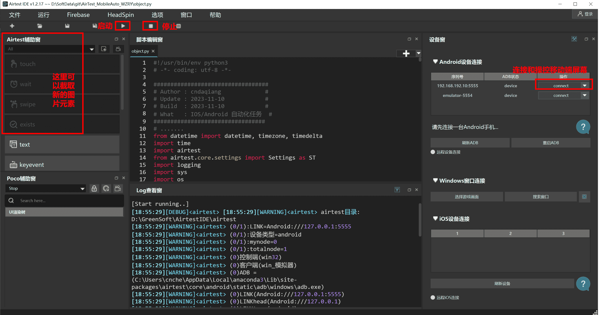

## 如果你在运行时遇到问题
* 可以先在本页面进行搜索
* 其次认真阅读使用手册
* 其实你读读源码`wzry.py`能解决你99%的问题
* 在[issues](https://github.com/cndaqiang/WZRY/issues)页面友善的提出问题.


## 如何提问能得到最快的解答
* 附上**执行结果、配置文件、运行目录、游戏页面、模拟器设置页面、cmd/powershell/terminal/vscode/pycharm等运行界面截图**,越多越好.
* **@cndaqiang或者为[WZRY项目](https://github.com/cndaqiang/WZRY)start加速解决问题的速度.**
* 语气和善,没人理会你的傲慢和懒惰.请遵守[提问的礼仪](https://github.com/tvvocold/How-To-Ask-Questions-The-Smart-Way).


## 进入不了大厅

*  **新用户,建议先手动进入大厅.**
* 活动更新了图标,检查我是否提供了[更新资源](guide/upfig.md),若我无法及时更新,请自行更新图标. 
* 模拟器的分辨率不是960x540、dpi不是160, 有些图标无法识别,自行调试脚本,不予解决
* 模拟器配置太低,王者卡住了.

* **多等一会** 
* 如果你没有配置模拟器的参数,本脚本在首次运行时,不知道模拟器当前处在什么界面,会进行大厅、房间、对战等状态的判断,在最后无法判断出来后(**这需要时间**),本脚本才会重新关闭打开王者,进行登录.十分钟以内可以进入,要有耐心.
* 若配置了模拟器的参数,并且运行脚本前,模拟器是关机状态,本脚本会自动启动模拟器,则会先执行登录命令,此时会加速进入大厅的速度.


## 进入不了人机房间

* 活动更新了图标,检查我是否提供了[更新资源](guide/upfig.md),若我无法及时更新,请自行更新图标. 
* 模拟器的分辨率不是960x540、dpi不是160, 有些图标无法识别,自行调试脚本,不予解决

## 战令、活跃礼包无法领取

* 同上 *[进入不了人机房间](进入不了人机房间)*
* 在新战令或者新模拟器上登录账号后,需要强制观看新战令的宣传,脚本检测不到战令界面.第一次手动点进去观看之后,王者就不强制观看了.
* 王者的礼包界面天天变,氪金不氪金界面不同,不同分辨率甚至QQ和微信登录后的界面也有很大差异
* 很难一个代码适配所有设备
* 自己查看屏幕输出,找到代码相应位置,用AirtestIDE截取你设备的图像,进行替换
* 也可以尝试,下载最新的release程序,**只复制你的config.win.yaml文件到新代码目录,重新进行礼包位置矫正**


## 连接不上模拟器
* 认真阅读[安装指南](guide/install.md)
* 配置文件写错了,认真阅读[配置文件](guide/config.md)
* 同时运行的模拟器太多,互相冲突.
* 模拟器没有开启ADB端口
* 手机没有通过电脑的ADB信任
* ADB服务被其他软件弄坏了,建议手动执行`adb kill-server`
* 在脚本运行过程中使用了escrcpy、airtestIDE、各种安卓玩机助手、ADB操作了模拟器
* 这些程序会阻断脚本的ADB连接,并且这些程序在退出的时候,会强制断开本脚本的ADB连接

## 脚本正在运行、突然提示连接不上模拟器,各种报错,但是模拟器正常
* 本脚本在各种报错后,会主动尝试修复,耐心等待即可.
* 同上 *[连接不上模拟器](#连接不上模拟器)*


## 连接失败,没有找到XXX设备
同上 *[连接不上模拟器](#连接不上模拟器)*

## python语法注入文件没有生效
例如

* 无法自动选择熟练度最低的英雄
* 我已经根据模拟器的编号将node更改为了10,现在的问题是它每次都会选择熟练度最高 

原因

* 抄错了控制文件
* 控制文件名写错了: 要把`WZRY.mynode.对战前插入.txt`中的`mynode`替换为本脚本控制的 **[账户编号](guide/file.md)**
* 如`WZRY.1.对战前插入.txt`,`WZRY.0.对战前插入.txt`分别调整第1和第0个王者账号.
* 理解错了[mynode和模拟器内部编号Instance的含义](guide/config.md#mynode与instance的区别),把模拟器内部的编号当成了mynode.


## 触摸对战不生效
* 配置文件写错了,同上[python语法注入文件没有生效](#python语法注入文件没有生效)

开启触摸对战的几种方法

* 在`WZRY.mynode.对战前插入.txt`中填入`self.触摸对战 = True`
* 在运行目录创建一个 `WZRY.TOUCH.txt`文件.
* 不推荐 ~~直接修改源码~~

## 标准对战不生效
* 同上

开启标准对战的几种方法

* 在`WZRY.mynode.对战前插入.txt`中填入`self.标准模式 = True`
* 不推荐 ~~直接修改源码~~


## 运行之后,很快接黑屏了,我怎么查看运行报错的信息
* 方法1. 在powershell中执行`python wzry.py config.win.yaml`, 向上滚可以查看日志
* 方法2. 在配置文件中添加日志输出
```
logfile:
    0: "result.0.txt"
```
会将`mynode=0`的账户的运行日志输出到`result.0.txt`, 提issues时,可以附上这个日志文件.

## 我想精准控制每一局采用何种模式对战,怎么改配置文件
* 利用`self.jinristep`变量,代表今天的第几次对战
* 好好读[使用手册.对战模式](guide/duizhanmoshi.md)

以第一次进行青铜+标准人机+触摸对战为例,在`WZRY.mynode.对战前插入.txt`中插入标准的python语法
```
self.青铜段位 = False
self.标准模式 = False
self.触摸对战 = False
if self.jinristep == 1: self.青铜段位 = True
if self.jinristep == 1: self.标准模式 = True
if self.jinristep == 1: self.触摸对战 = True
```


## 试问这个脚本可以直接拿去打排位或者匹配吗？
可以,但是会被扣信誉分,不推荐

## 该脚本有没有1v1挂机墨家机关道刷经验的功能
* 没有,1v1会被举报.
* 刷经验建议5v5青铜人机挂机. 蓝豆升红豆,使用星耀人机.
* 刷信誉分使用王者模拟战.

## 作者有时间加入新功能吗

* 目前已是最具性价比的日活方案
* 除非新的玩法比人机、王者模拟战更省时间能获得更多的奖励,否则不会加入

## 有计划提供apk么
* 无计划, 该项目初衷是为了脚本、模拟器7*24h在服务器上完成运行的
* 手机上可以安装python, 然后在后台执行`python wzry.py`

## 建议大号使用吗
* 所有账号均可使用,不属于外挂.
* 两年来没收到受到处罚

!!! wannring
    模拟器太卡, 网络太卡, 以及某些时间段匹配时间过长，有极小的概率没有及时点击确认匹配, 会扣信誉分. 
    root的设备运行体验服,被被封号.关闭模拟器的root选项.
    在模拟器上安装微信,有封号风险.别安装微信.


## 怎么使用AirtestIDE
该问题不属于本仓库的范围

* 参考官方教程 https://airtest.doc.io.netease.com/IDEdocs/3.1getting_started/mainwindow_intro/
* 阅读[截取英雄分路坐标的流程](guide/shuliandu.md#计算绝对坐标的步骤)
* 我就只用AirtestIDE右侧的连接设备,左侧的touch按钮,截图后,把图片复制到`assets`目录,把截图后生成的代码复制到`wzry.py`中进行再次的修改


## ARM设备无法执行adb
* 使用linux的用户都是高手,你一眼就能看出这个解决办法
```
cd ~/.local/lib/python3.10/site-packages/airtest/core/android/static/adb/linux
mv adb adb.bak
ln -s /usr/bin/adb .
```

## 苹果笔记本(MacOS)无法控制安卓
* 在苹果设备上使用python脚本的你,这个命令对你来说也是小意思
```
chmod +x ~/anaconda3/lib/python3.11/site-packages/airtest/core/android/static/adb/mac/adb
```

## 在 cmd/powershell 中执行时,程序偶尔卡住,回车后继续
windows的cmd默认开启了快速编辑模式,如果在执行过程中,有复制选中等行为,会强制让命令停住

**搜索取消windows cmd快速编辑**,下面是一些解决方案

* https://www.cnblogs.com/mq0036/p/12100632.html
* https://www.cnblogs.com/LRolinx/p/16695671.html


## 模块[airtest_mobileauto]不存在, 尝试安装
* `RuntimeError: module compiled against ABI version 0x1000009 but this version of numpy is 0x2000000`

```
模块[airtest_mobileauto]不存在, 尝试安装
Traceback (most recent call last):
File "G:\WZRY\wzry.py", line 2902, in
task_manager = TaskManager(config_file, wzry_task, 'RUN')
^^^^^^^^^^^
NameError: name 'TaskManager' is not defined
```

* 读一下[安装指南](guide/install.md)啊, 第一条就是安装依赖
```
python -m pip install airtest_mobileauto --upgrade
```
* python的问题,不在本脚本讨论范围内,卸载python,使用anaconda安装python

## 星耀模式无法组队

星耀局的组队没有意义,因为

* 刷人机任务,刷金币,刷熟练度,只用青铜局就够了
* 蓝色熟练度提升到红色熟练度才需要星耀局人机,星耀局单人模式比组队模式的胜率更高,经验更多（毕竟除了你还有一个真人在打游戏）
* 每个账号每天星耀限制10局,不同的账户剩余局数不同.当一个账户达到上限时,组队失败

新版本已经开放星耀组队功能.


## 加好友指导一下
* 不加好友
* 你如果没有能力阅读本手册,说明这个脚本不适合你.

## 控制游戏只打N局,打完就退出,怎么操作
见[高级功能](guide/file.md#控制运行时间示例)

## 控制游戏只在每天的12点~14点进行对局,打完就退出,怎么操作
见[高级功能](guide/file.md#控制运行时间示例)


## 如何使用模拟战刷信誉分
* 在娱乐模式的快捷入口添加王者模拟战
* 自己手动进去打一轮(同意协议,领取礼包,预设阵容)
* 返回大厅
* 在`WZRY.mynode.对战前插入.txt`中添加`self.对战模式 = "模拟战"`, 执行`wzry.py`代码


## 苹果手机怎么使用
* **不回复相关问题**
* 从[1.2.2](https://github.com/cndaqiang/WZRY/releases/tag/1.2.2)版本开始,我的苹果账户已经刷完了,没有精力继续测试维护
* ios部分的代码,太久没有更新,能否使用请自行尝试.
* 这是我当初的运行环境: [Android/IOS移动平台自动化脚本(基于AirTest)](https://cndaqiang.github.io/2023/11/10/MobileAuto/)


## 如何刷完任务自动关机/如何自动开启模拟器
* 在运行目录创建`WZRY.oneday.txt`文件
* 然后阅读[配置文件](guide/config.md#模拟器参数), 添加模拟器的参数
* 注意区分[账户编号与模拟器实例编号的区别](guide/config.md#mynode与instance的区别)
* 按照[控制运行时间示例](guide/file.md#控制运行时间示例)将你希望的时间填到`WZRY.mynode.临时初始化.txt`

## 小号没有进入大号房间
配置文件写错了,认真阅读[组队教程](guide/zudui.md)

* 创建友情关系
* 更新房主图片
* `totalnode: 总账户数`
* `multiprocessing: True`
* `LINK_dict`, 0号账户必须对应房主的ADB地址