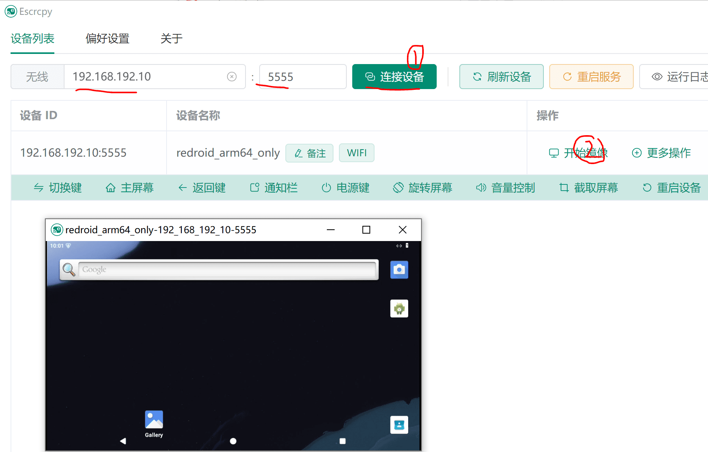
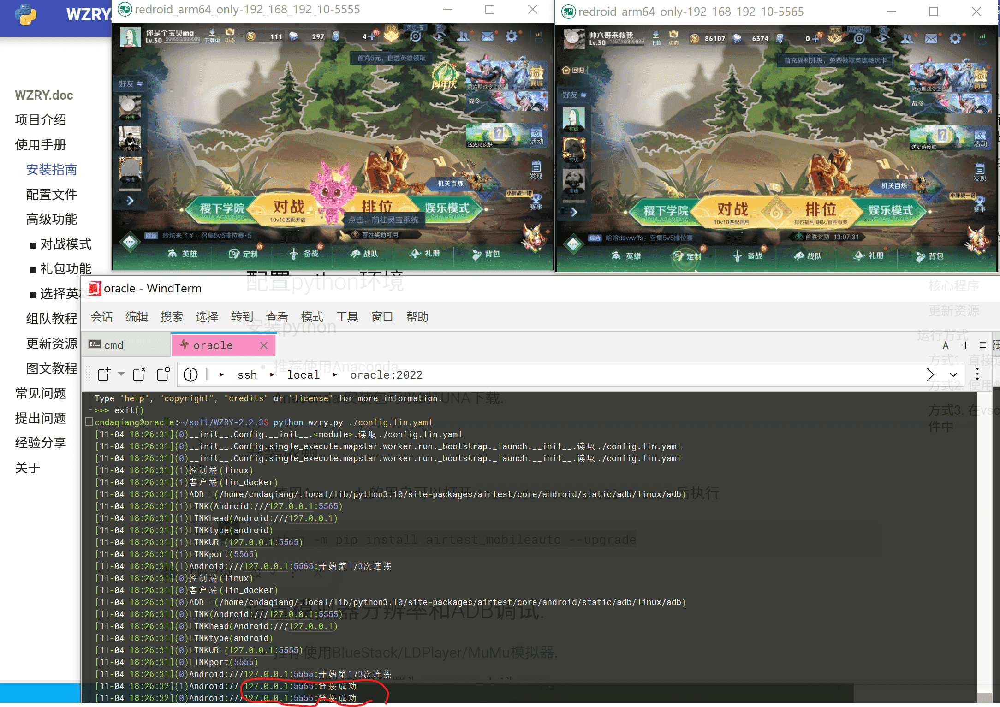

# 在甲骨文免费服务器上安装redroid并配置WZRY
## 说明
* 该页面是介绍我的使用经验,不是教程
* 随着软件更新,这些经验可能不再适用
* 谨慎阅读


## 安装redroid
```
# 有墙, 从镜像站拉取最新的redroid容器，寻找适合自己的镜像站
docker pull dockerhub.anzu.vip/redroid/redroid:15.0.0_64only-latest
#
# 创建容器
cndaqiang@oracle:~$ N=0;port=5555
cndaqiang@oracle:~$ docker run -itd  --privileged \
        -p $port:5555 \
        --name androidcontain$N \
        dockerhub.anzu.vip/redroid/redroid:15.0.0_64only-latest \
        androidboot.redroid_width=960 \
        androidboot.redroid_height=540 \
        androidboot.redroid_dpi=160 \
        androidboot.hardware=WLZ-AN00 ro.secure=0 ro.boot.hwc=GLOBAL    \
        ro.ril.oem.imei=861503068361$((100 + $RANDOM % 900)) ro.ril.oem.imei1=861503068361$((100 + $RANDOM % 900))  \
        ro.ril.oem.imei2=861503068361$((100 + $RANDOM % 900)) ro.ril.miui.imei0=861503068361$((100 + $RANDOM % 900)) \
        ro.product.manufacturer=HUAWEI ro.build.product=chopin \
        androidboot.redroid_fps=10 \
        redroid.gpu.mode=guest
```


### 连接redroid

使用Escrcpy连接redroid


## 安装王者荣耀
从[https://pvp.qq.com/](https://pvp.qq.com/)获得下载连接
```
cndaqiang@oracle:~$ wget "https://dlied4.myapp.com/myapp/1104466820/cos.release-40109/10040714_com.tencent.tmgp.sgame_a3374327_10.1.1.6_VlRaes.apk"
cndaqiang@oracle:~$ adb connect 127.0.0.1:5555
connected to 127.0.0.1:5555
cndaqiang@oracle:~$ adb -s 127.0.0.1:5555 install 10040714_com.tencent.tmgp.sgame_a3374327_10.1.1.6_VlRaes.apk 
```

极简更新>登录>进入大厅>

* 更新资源
* 设置游戏画质最低
* 手动进入一次人机房间
* 手动进入一次战令页面
* 手动进入一次模拟战房间
* 返回大厅

## 多开设置
重复上面的操作,创建第二个redroid容器
```
cndaqiang@oracle:~$ N=1;port=5565
.......
```

## 配置WZRY
下载
```
cndaqiang@oracle:~/soft$ wget https://github.com/cndaqiang/WZRY/archive/refs/tags/2.2.3.zip
cndaqiang@oracle:~/soft$ unzip -x 2.2.3.zip 
cndaqiang@oracle:~/soft$ cd WZRY-2.2.3
```

创建[docker参数](../guide/config.md#docker参数)`vi config.lin.yaml`
```
# 节点配置
totalnode: 2
multiprocessing: True
LINK_dict:
    0: "Android:///127.0.0.1:5555"
    1: "Android:///127.0.0.1:5565"
dockercontain:
    0: "androidcontain0"
    1: "androidcontain1"
logfile:
    0: result.0.txt
    1: result.1.txt
prefix: wzry
```

创建控制文件, `WZRY.0.运行模式.txt`的内容同[我在用的控制文件](duizhanmoshi.md)
```
vi WZRY.0.运行模式.txt
ln -s  WZRY.0.运行模式.txt WZRY.1.运行模式.txt
```


## 个性化配置
### 今日仍在周年庆需要更新
从[更新资源](../guide/upfig.md)获得更新资源
```
cndaqiang@oracle:~/soft/WZRY-2.2.3$ wget https://wzry-doc.pages.dev/file/2024-11-04-update/update.zip
cndaqiang@oracle:~/soft/WZRY-2.2.3$ unzip -x update.zip
```

### 更新房主头像
代码里面就是我的头像,所以我不用更新

## 运行WZRY
```
# 更新依赖
cndaqiang@oracle:~/soft/WZRY-2.2.3$ python3 -m pip install airtest_mobileauto --upgrade
# 运行
cndaqiang@oracle:~/soft/WZRY-2.2.3$ python3 wzry.py ./config.lin.yaml 
```

运行成功截图



## 配置定时启动

```
cndaqiang@oracle:~/soft/WZRY-2.2.3$ crontab -e
```

计划任务内容
```
51 4 * * * /usr/lib/android-sdk/platform-tools/adb kill-server
0 5 * * * cd /home/cndaqiang/soft/WZRY-2.2.3 && /usr/bin/python3 wzry.py ./config.lin.yaml  > result.txt 2>&1
50 11 * * *  pkill -f 'wzry.py'
```