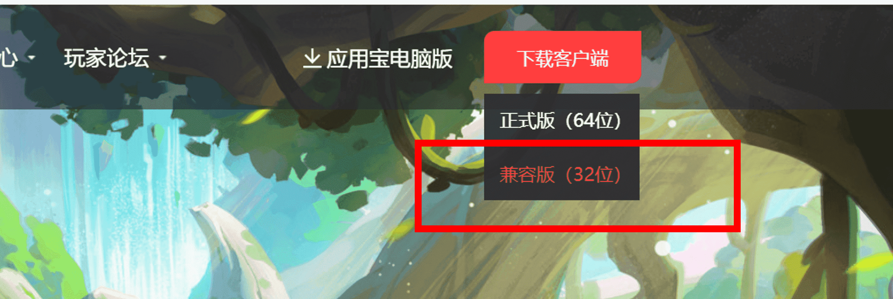
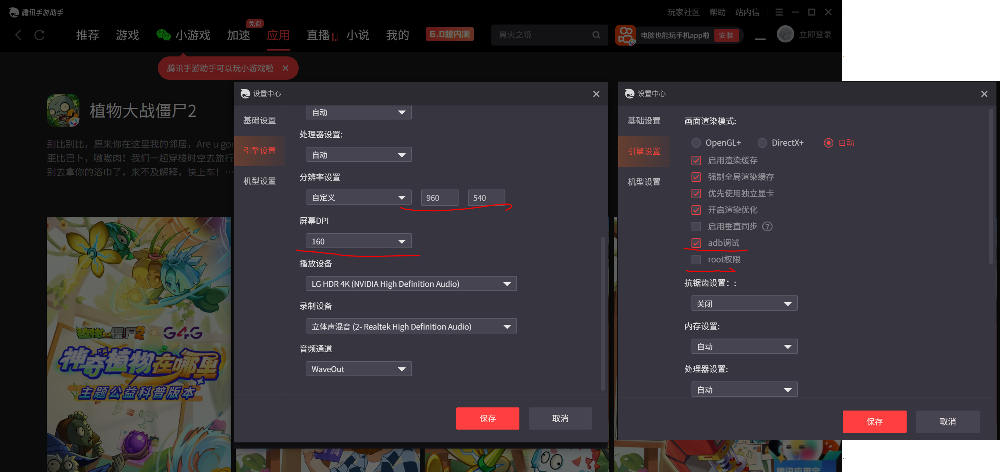
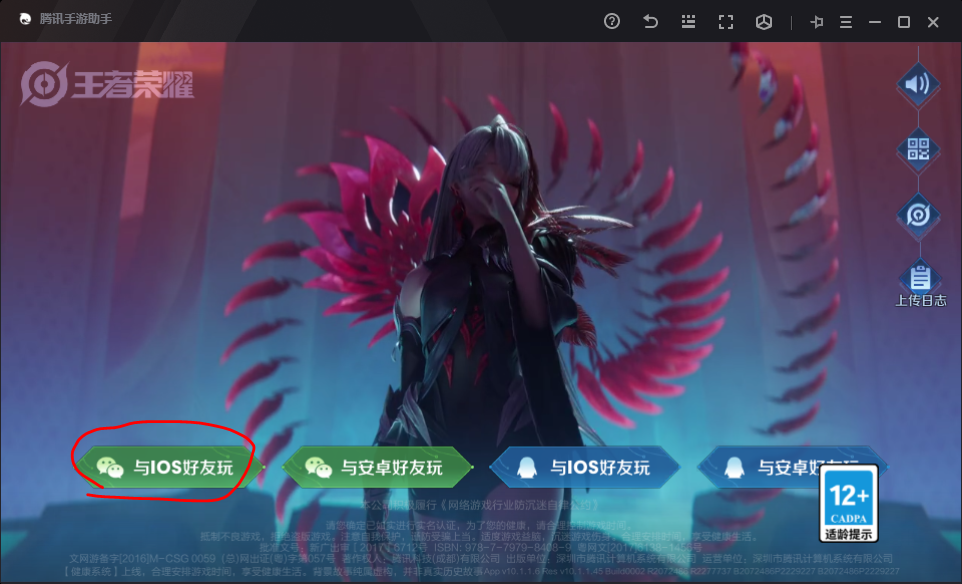
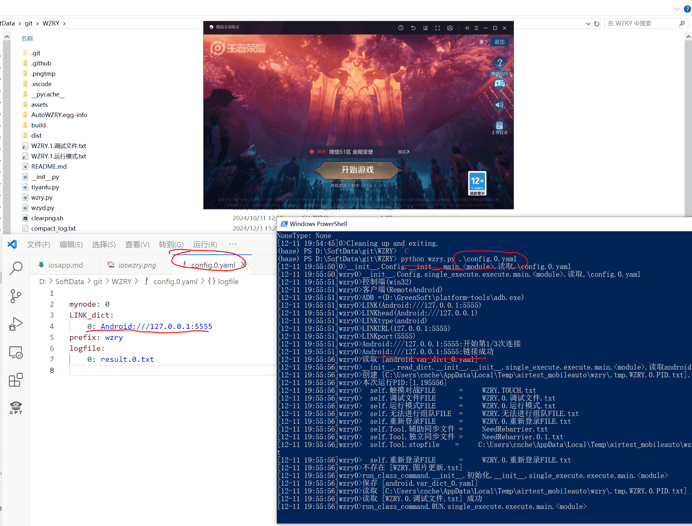
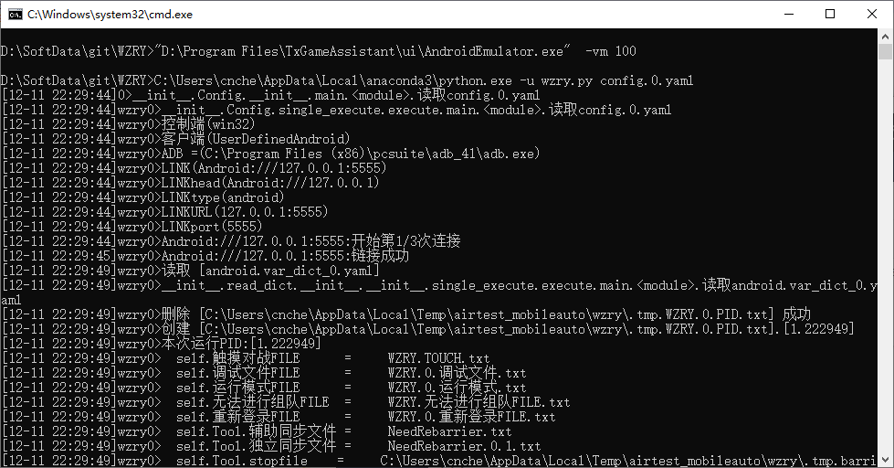
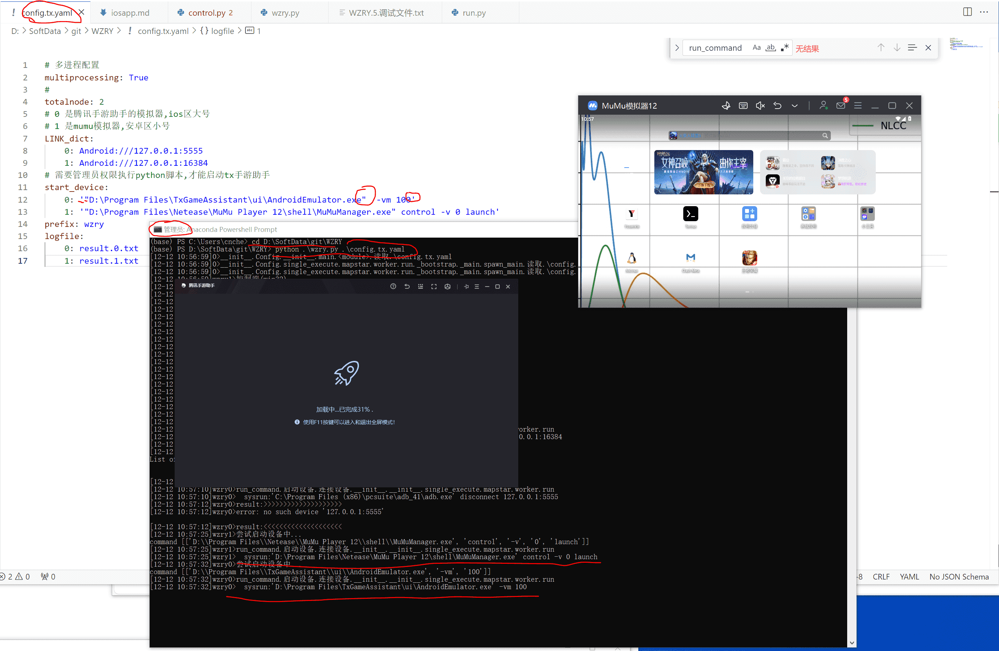

# 使用32位腾讯手游助手刷ios区的日活
## 说明
* 该页面是介绍我的使用经验,不是教程
* 随着软件更新,这些经验可能不再适用
* 谨慎阅读
* 目前新版的应用宝桌面版和腾讯手游助手都是基于WSA的框架, 每个app都是独立的窗口, 无法adb控制
* **但是老版(32位兼容版)的腾讯手游助手还是传统的模拟器模式**,并且可以登录ios区的账户
* 且用且珍惜, 万一以后腾讯砍了这个32位兼容版就没法刷了


## 下载32位腾讯手游助手
打开[https://syzs.qq.com/](https://syzs.qq.com/),下载



## 在手游助手中安装王者后,设置模拟器


登录游戏,更新,**强烈建议手动进入大厅,关闭一些广告**



## 和普通安卓区一样运行代码
* 安装WZRY代码的方法同[安装指南](../guide/install.md)

```
python wzry.py config.0.yaml
```



默认的adb地址是`127.0.0.1:5555`
```
mynode: 0
LINK_dict:
    0: Android:///127.0.0.1:5555
prefix: wzry
logfile:
    0: result.0.txt
```

## 进阶


### ios区和安卓区组队
* **需要提前手动打开各个模拟器**

```
totalnode: 2
# 0 是腾讯手游助手的模拟器,ios区大号
# 1 是安卓区小号
LINK_dict:
    0: Android:///127.0.0.1:5555
    1: Android:///127.0.0.1:16384
prefix: wzry
logfile:
    0: result.0.txt
    1: result.1.txt
```


### 自动启动腾讯手游助手
* 现在[airtest_mobileauto](https://github.com/cndaqiang/airtest_mobileauto)并未适配腾讯手游助手, 
* 暂时在定时启动的自动化bat脚本中, 添加启动模拟器的命令
* 不需要管理员权限


```
"D:\Program Files\TxGameAssistant\ui\AndroidEmulator.exe"  -vm 100
%USERPROFILE%\AppData\Local\anaconda3\python.exe -u wzry.py config.0.yaml
```



### 腾讯手游助手和MuMu模拟器自动化启动和控制
* **需要管理员权限**才能在python中启动腾讯手游助手

```
# 多进程配置
multiprocessing: True
#
totalnode: 2
# 0 是腾讯手游助手的模拟器,ios区大号
# 1 是mumu模拟器,安卓区小号
LINK_dict:
    0: Android:///127.0.0.1:5555
    1: Android:///127.0.0.1:16384
# 需要管理员权限执行python脚本,才能启动tx手游助手
start_device:
    0: '"D:\Program Files\TxGameAssistant\ui\AndroidEmulator.exe"  -vm 100'
    1: '"D:\Program Files\Netease\MuMu Player 12\shell\MuMuManager.exe" control -v 0 launch'
prefix: wzry
logfile:
    0: result.0.txt
    1: result.1.txt
```

