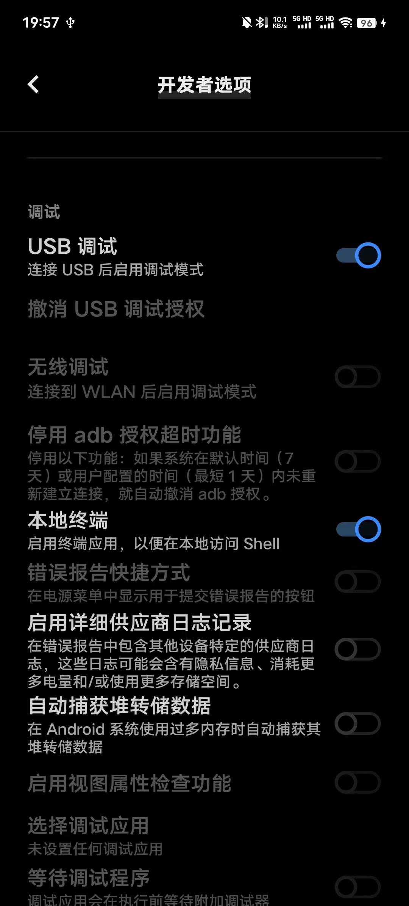
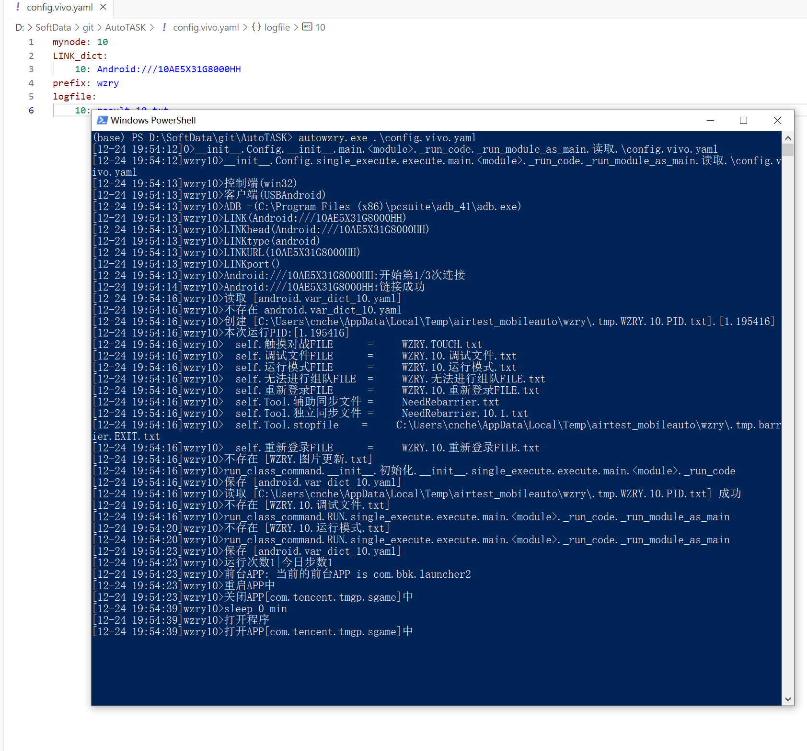

## 说明
* 该页面是介绍我的使用经验,不是教程
* 随着软件更新,这些经验可能不再适用
* 谨慎阅读
* 原则上所有`16:9`屏幕比例的安卓设备都可以使用本脚本(`960:540=16:9`)
* 即使你的手机屏幕比例不是16:9,大多数的功能还是可以使用的.
* 设置好`LINK_dict`后, 就可以运行本脚本查看效果了
* **为了提高成功率, 手动进入王者的大厅页面**
* **注意, 手机运行会发烫, 把屏幕亮度设到最低，画质、帧率也拉低**

## WIFI控制手机示例

**手机打开ADB无线配对,电脑adb连接**


```
(base) cndaqiang@macmini ~$ adb pair 192.168.12.109:39833
Enter pairing code: 527695
Successfully paired to 192.168.12.109:39833 [guid=adb-4e86ac13-GhtB4l]
#注意配对端口和连接端口不一样
(base) cndaqiang@macmini ~$ adb connect 192.168.12.109:41857
connected to 192.168.12.109:41857
```

配置文件
```
mynode: 0
LINK_dict:
  0: Android:///192.168.12.109:41857
```


## MacOS下USB控制手机示例


配置文件
```
mynode: 0
LINK_dict:
  0: Android:///4e86ac13
```

## Windows下USB控制vivo手机示例
* 开发者模式打开adb




* 运行脚本



配置文件
```
mynode: 10
LINK_dict:
    10: Android:///10AE5X31G8000HH
prefix: wzry
logfile:
    10: result.10.txt
```

