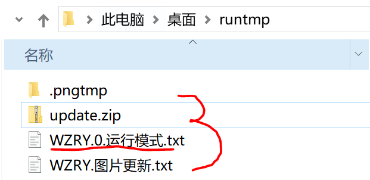
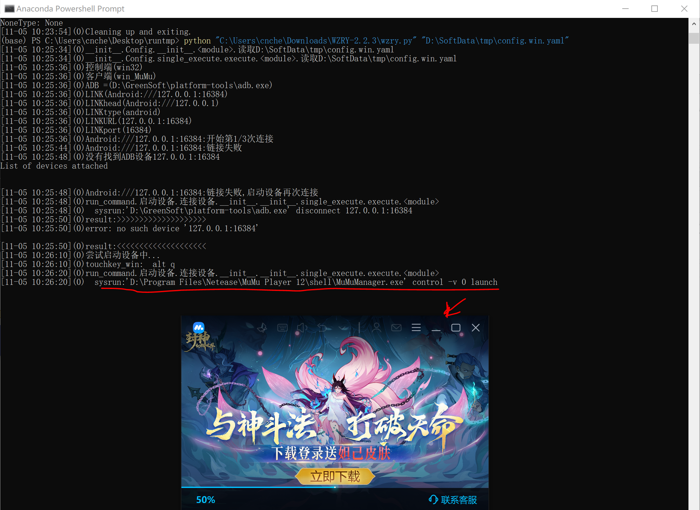

# 我希望脚本运行目录和代码目录分开, 保持代码目录的干净
## 说明
* 该页面是介绍我的使用经验,不是教程
* 随着软件更新,这些经验可能不再适用
* 谨慎阅读


## 在任意目录创建配置文件
主要指定静态图片的位置`figdir`, 例如`figdir: C:\Users\cnche\Downloads\WZRY-2.2.3\assets`


具体示例,`D:\SoftData\tmp\config.win.yaml`
```
#client
# 仅在单进程时有效
mynode: 0
# 多进程时，多进程的数目
totalnode: 1
#MuMu模拟器
MuMudir: D:\Program Files\Netease\MuMu Player 12\shell
LINK_dict:
    0: Android:///127.0.0.1:16384

# 静态图片目录
figdir: C:\Users\cnche\Downloads\WZRY-2.2.3\assets
```

## 运行代码
新建临时目录并执行示例
```
(base) PS C:\Users\cnche\Desktop> mkdir runtmp


    目录: C:\Users\cnche\Desktop


Mode                 LastWriteTime         Length Name
----                 -------------         ------ ----
d-----         2024/11/5     10:22                runtmp


(base) PS C:\Users\cnche\Desktop> cd .\runtmp\
# 注意,如果有资源更新的话, 需要将更新资源解压到运行目录, 即这个runtmp目录
(base) PS C:\Users\cnche\Desktop\runtmp> python "C:\Users\cnche\Downloads\WZRY-2.2.3\wzry.py" "D:\SoftData\tmp\config.win.yaml"
```


!!! Note
    注意,如果有资源更新的话, 需要将更新资源解`update.zip`压到运行目录, 即这个runtmp目录.<br>
    同样的控制文件`WZRY.mynode.运行模式.txt`也应该放到这个目录. 即如图<br>
    


结果展示

