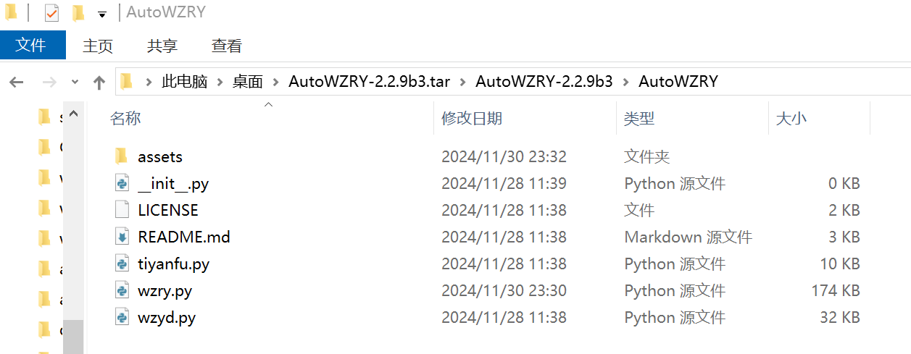

## 说明
* 该页面是介绍我的使用经验,不是教程
* 随着软件更新,这些经验可能不再适用
* 谨慎阅读
* 只有你无法访问github时, 才推荐从pypi的镜像站下载[AutoWZRY@pypi](https://pypi.org/project/AutoWZRY/)
* **能访问github的情况下, 尽量从[WZRY@GitHub](https://github.com/cndaqiang/WZRY/releases)下载最新的代码**

## 将代码推送到pypi
* 这样国内的用户就可以从pypi镜像站下载代码了
* 下载地址: [https://mirrors.cernet.edu.cn/pypi/web/simple/autowzry/](https://mirrors.cernet.edu.cn/pypi/web/simple/autowzry/)
* 下载后需要解压两次, 得到`AutoWZRY-x.x.x`文件夹, 里面的内容和[WZRY@GitHub](https://github.com/cndaqiang/WZRY/releases)有些许差别, 但使用方法完全相同.



## 如何推送到pypi

### setup.py
```
from setuptools import setup

setup(
    name='AutoWZRY',
    version='2.2.8', #a1,b1,rc1,dev1,post1
    author='cndaqiang',
    author_email='who@cndaqiang.ac.cn',
    description='王者荣耀自动化农活脚本.',
    long_description=open('README.md', encoding='utf-8').read(),
    long_description_content_type='text/markdown',
    py_modules=['wzry', 'wzyd', 'tiyanfu'],
    package_data={
        'assets': ['assets/*'],  # Include all files from assets
    },
    include_package_data=True,  # Ensure package_data is included
    url='https://github.com/cndaqiang/WZRY', 
    install_requires=[
        'airtest-mobileauto>=2.0.12',
    ],
    classifiers=[
        'Development Status :: 5 - Production/Stable',
        'Intended Audience :: Developers',
        'License :: OSI Approved :: MIT License',
        'Programming Language :: Python :: 3',
        'Topic :: Utilities',
    ],
    python_requires='>=3.6',
)
```


### pypi.bat
```
rmdir /s /q dist
%USERPROFILE%\AppData\Local\anaconda3\python.exe setup.py sdist
%USERPROFILE%\AppData\Local\anaconda3\python.exe -m twine upload dist/*
```