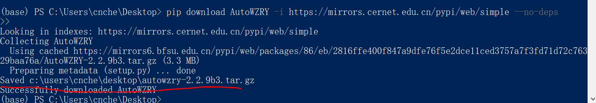

## 说明
* 该页面是介绍我的使用经验,不是教程
* 随着软件更新,这些经验可能不再适用
* 谨慎阅读
* 只有无法访问github时, 才推荐从PyPI下载[AutoWZRY](https://pypi.org/project/AutoWZRY/)
* **能访问github的情况下, 尽量从GitHub下载最新的[WZRY](https://github.com/cndaqiang/WZRY/releases)代码**

## 从pypi下载AutoWZRY
```
pip download AutoWZRY -i https://mirrors.cernet.edu.cn/pypi/web/simple --no-deps
```



下载后需要解压多次, 得到`AutoWZRY-x.x.x`文件夹, [AutoWZRY](https://pypi.org/project/AutoWZRY/) 的内容和[WZRY](https://github.com/cndaqiang/WZRY)有些许差别, 但使用方法完全相同.

