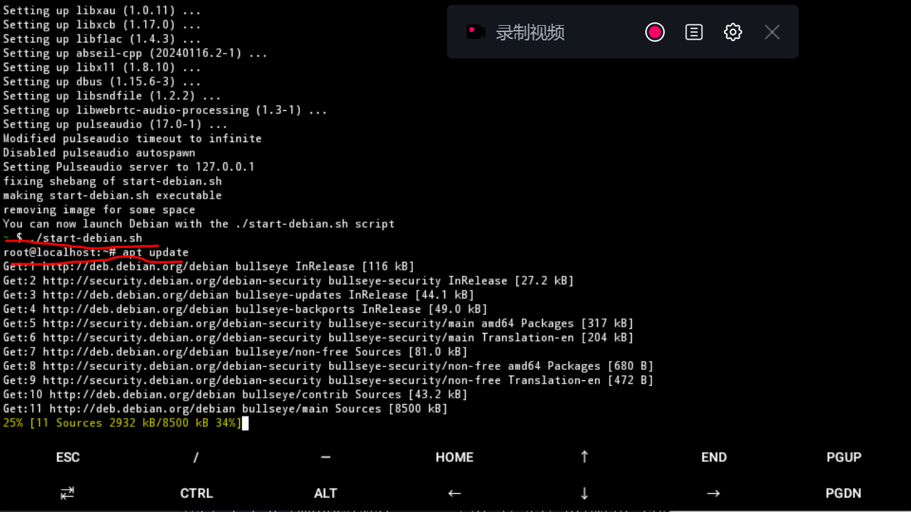
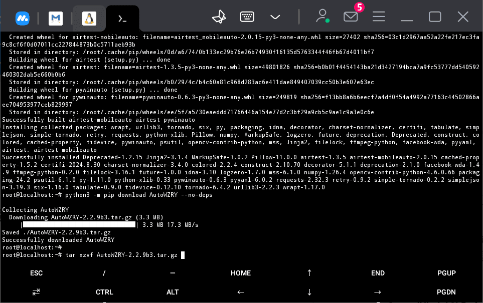

# 只用一部手机、不依赖电脑运行自动化脚本

## 说明
* 该页面是介绍我的使用经验,不是教程
* 随着软件更新,这些经验可能不再适用
* 谨慎阅读
* 使用termux控制脚本做农活仅用作测试, **并不推荐使用**.
* 没有linux基础的用户不要尝试.
* 或许唯一的用途是在常用的手机/平板上刷日活.

## 安装Debian
安装软件

* [termux](https://github.com/termux/termux-app)
* [AnLinux-App](https://github.com/EXALAB/AnLinux-App)
* **开启科学网络环境**用于安装Debian和依赖
* 使用AnLinux安装**Debian**


## 配置依赖
```
~ $ ./start-debian.sh
root@localhost:~# apt update
```


依次执行
```
apt install python3 python3-pip android-tools-adb python3-dev build-essential libatlas-base-dev vim
#pip安装的一些库不能用,适用apt替代
apt install python3-numpy python3-opencv libgl1-mesa-glx libgtk2.0-dev python3-pillow python3-psutil
#安装airtest-mobileauto
python3 -m pip install airtest-mobileauto
#卸载python装的依赖, 使用系统的依赖
python3 -m pip uninstall opencv-python opencv-contrib-python opencv-python-headless -y
```

## 配置WZRY
### 下载AutoWZRY
```
python3 -m pip download autowzry --no-deps
tar xzvf autowzry-2.2.9b3.tar.gz
cd autowzry-2.2.9b3/autowzry/
```



### 写配置文件
查看adb地址
```
adb devices
```

写配置文件
```
cat > config.lin.yaml << EOF
mynode: 0
prefix: wzry
figdir: assets
logfile:
  0: result.0.txt
LINK_dict:
  0: "Android:///emulator-5554"
EOF
```


## 运行
此处以体验服脚本为例
```
python3 tiyanfu.py config.lin.yaml
```


