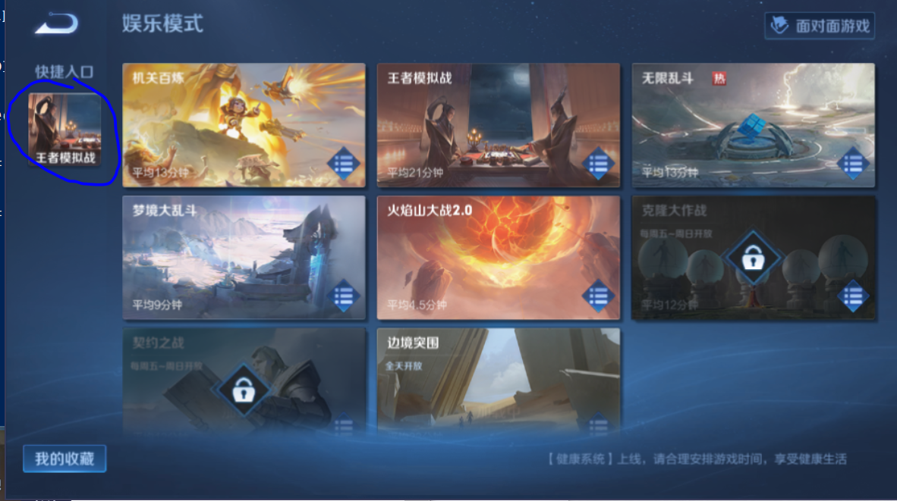
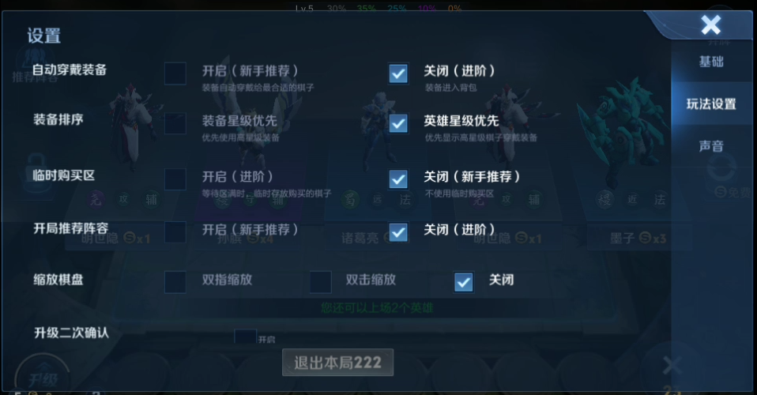

## 说明
* 该页面是介绍我的使用经验,不是教程
* 随着软件更新,这些经验可能不再适用
* 谨慎阅读

## 如何刷信誉分
* 每天参与非人机对战可以恢复5分
* 使用本脚本的**模拟战**模式(`self.对战模式 = "模拟战"`)可以自动刷5分

## 如何使用模拟战刷信誉分
* 在娱乐模式的快捷入口添加王者模拟战

* 把这些设置都关闭(不然老弹窗), 基础设置里帧率、分辨率全部设为最低.
* 
* 自己手动进去打一轮(同意协议,领取礼包,预设阵容)
* 返回大厅
* 在`WZRY.mynode.运行模式.txt`中添加`self.对战模式 = "模拟战"`, 执行`wzry.py`代码
