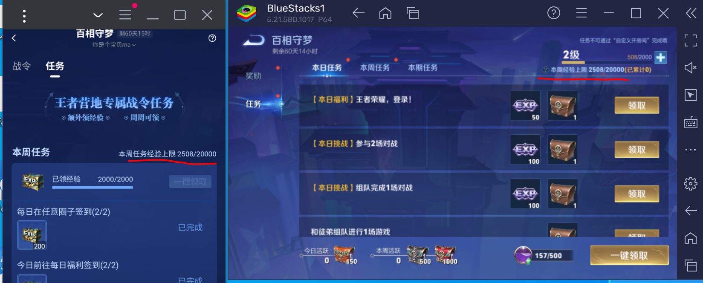

## 说明
* 该页面是介绍我的使用经验,不是教程
* 随着软件更新,这些经验可能不再适用
* 谨慎阅读


## 战令经验来源

* 王者荣耀本日、本周任务、有上限20000/周,使用本脚本挂机模式,一上午就能达到20000/周的目标
* 王者荣耀本期战令任务,没有上限,特别活动有时间限制.
* 王者营地专属战令经验礼包, 获取后可以在任意赛季使用.
* 当王者荣耀本日、本周任务获得的经验达到上限后,营地也无法继续领取经验礼包.



## 最大化经验获取

* 王者荣耀日活战令经验上限20000/周
* 达到该上限后,王者营地也无法领取
* 因此,应该优先做王者营地的专属战令任务,领2000经验. 大约800/天,周五就可以领完.
* 王者荣耀对局胜利时,会默认领一些战令礼包,所以周一到周五, 我使用的都是`wzry.py`脚本的人机组队青铜5v5TOUCH模式完成了日活,并且关闭礼包功能(`self.每日任务礼包`),不会触发战令经验上限
* 周末才开启`wzry.py`脚本内的日活礼包功能.

`WZRY.mynode.运行模式.txt`内容为
```
self.启动礼包功能 = True
self.每日任务礼包=self.Tool.time_getweek() > 4 # 周一~周五, 不领取战令经验, 避免达到上限
# 我是在Bluestack中运行的王者荣耀, Bluestack运行王者营地会闪退,因此我没有开启`wzry.py`的营地功能
self.外置礼包_王者营地 = False
# 而是在MuMu里面安装的王者营地,单独使用`wzyd.py`领取MuMu里面的营地礼包
```
`WZRY.mynode.运行模式.txt`内容为
```
if self.组队模式 and self.Tool.time_getweek() < 6: self.触摸对战 = True
```


## 如何使用本脚本快速刷战令的本期任务

|任务|脚本模式|备注|
|-|-|-|
|累计击败250次英雄|人机青铜挂机模式| |
|英雄提升熟练度|人机挂机模式| 新出的英雄,我一般不刷熟练度,而是留到新战令再刷|
|参与20场娱乐模式|模拟战模式|
