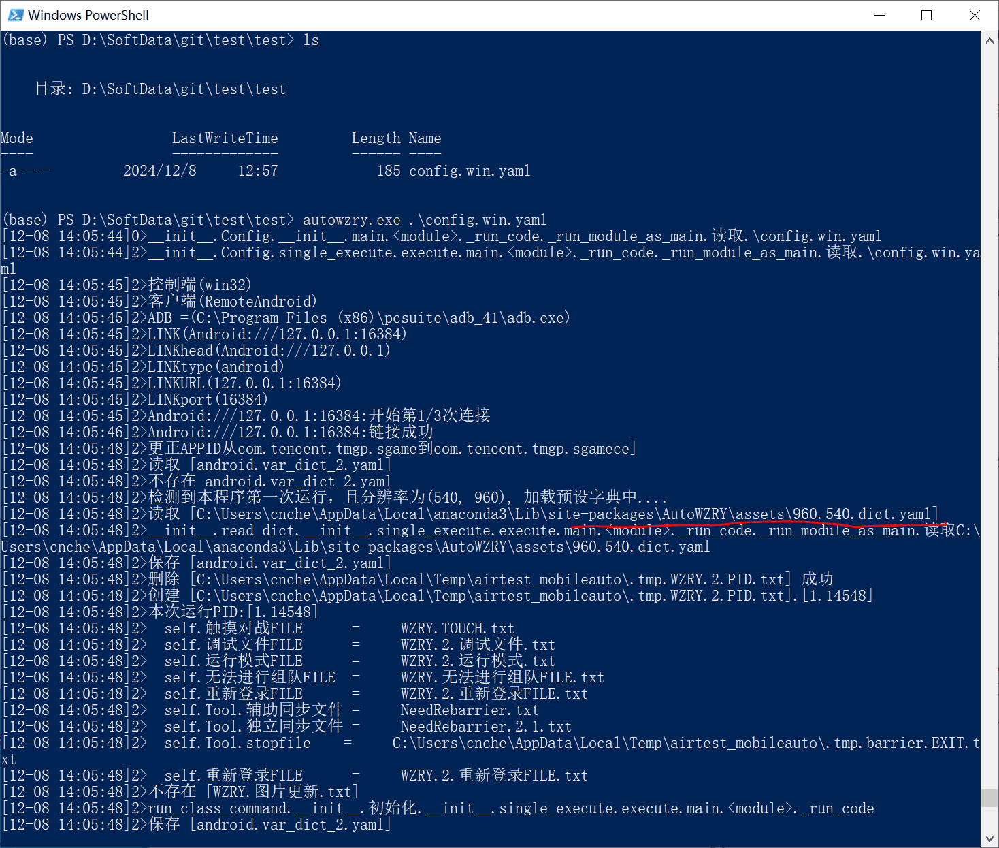

## 说明
* 请在**会使用WZRY后**, 再尝试阅读本页文档(Python老手可以直接阅读)
* [AutoWZRY](https://pypi.org/project/AutoWZRY/)是[WZRY](https://github.com/cndaqiang/WZRY)的模块版
* [AutoWZRY](https://pypi.org/project/AutoWZRY/)的使用方法和原版的[WZRY](https://github.com/cndaqiang/WZRY)基本相同
* [AutoWZRY](https://pypi.org/project/AutoWZRY/)可以**在任意目录通过`autowzry.exe config.win.yaml`执行**

## 安装模拟器和登陆游戏
同[安装模拟器和登陆游戏](../guide/install.md)

## 安装autoWZRY

```
python -m pip install autoWZRY --upgrade
```

## 运行
* 创建[配置文件:config.win.yaml](../guide/config.md)
* 可选[控制文件](../guide/file.md)
* 可选[更新资源](../guide/upfig.md)
* 注意**配置文件`config.win.yaml`,控制文件`WZRY.mynode.运行模式.txt`,图片更新`WZRY.图片更新.txt`都是放在运行目录**不是放到代码目录


### windows下运行autowzry
```
autowzry.exe config.win.yaml
```


### linux下运行autowzry
```
cndaqiang@oracle:~/soft/autoWZRY$ ls
android.var_dict_0.yaml  android.var_dict_1.yaml  config.0.yaml  config.lin.yaml  result.0.txt  result.0.txt.old.txt  result.1.txt  result.1.txt.old.txt  result.txt  run.sh  WZRY.0.调试文件.txt  WZRY.0.运行模式.txt  WZRY.1.调试文件.txt  WZRY.1.运行模式.txt
cndaqiang@oracle:~/soft/autoWZRY$ autowzry config.lin.yaml
```


体验服和营地礼包也可以独立运行
```
autowzyd.exe config.win.yaml
autotiyanfu.exe config.win.yaml
```

## 计划任务
`crontab -e`

```
#crontab支持path
PATH=/home/cndaqiang/.local/bin:/usr/lib/jvm/java-11-openjdk-arm64/bin:/usr/local/sbin:/usr/local/bin:/usr/sbin:/usr/bin:/sbin:/bin:/usr/games:/usr/local/games:/snap/bin
0 5 * * * cd /home/cndaqiang/soft/autoWZRY && autowzry config.lin.yaml > result.txt 2>&1
50 11 * * *  pkill -f 'autowzry'
```