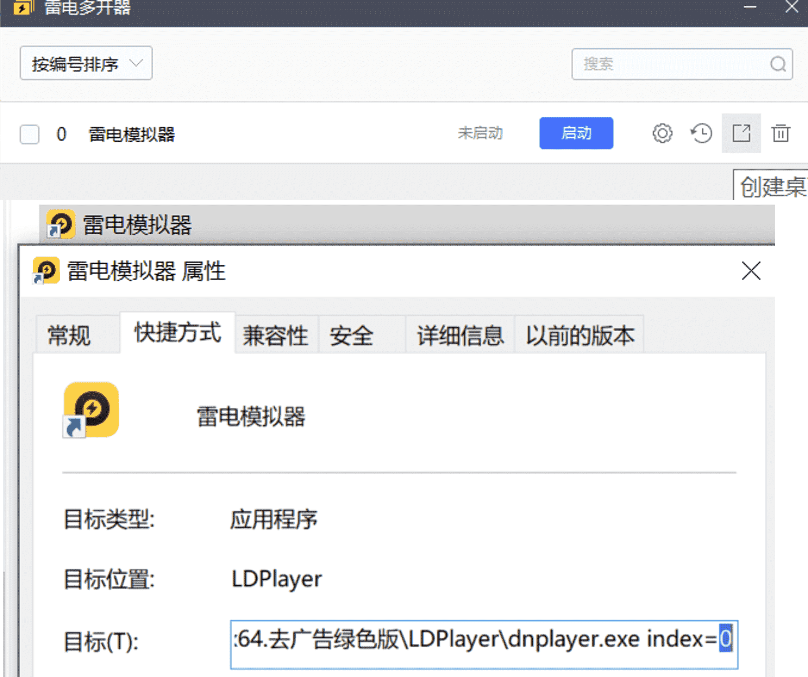
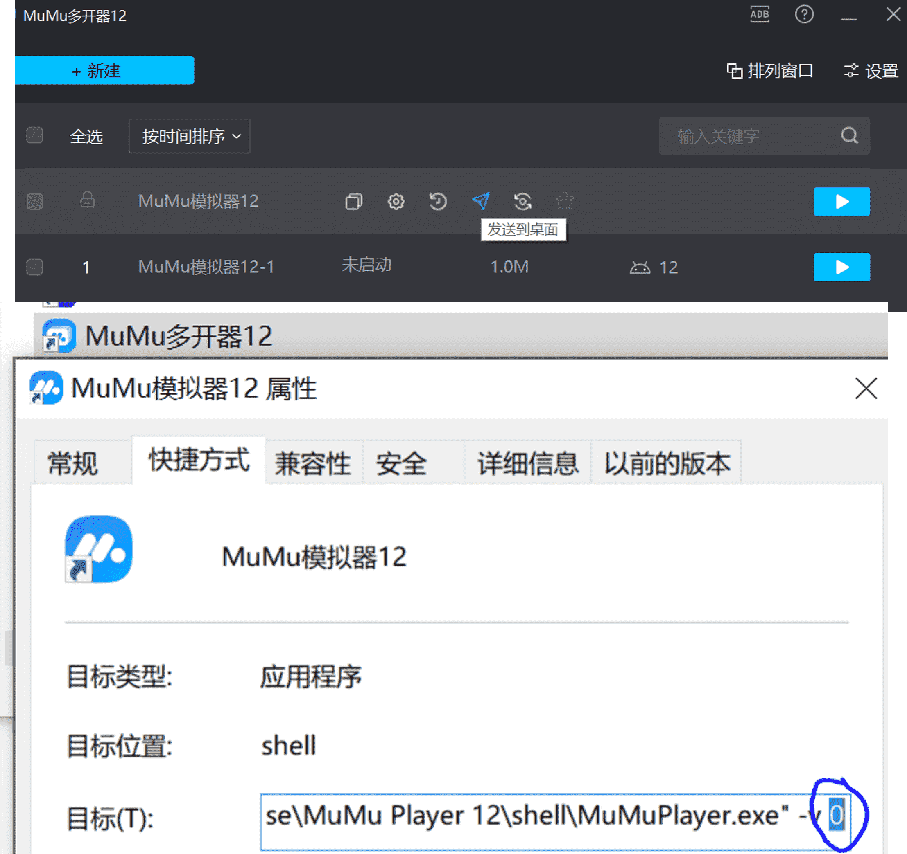
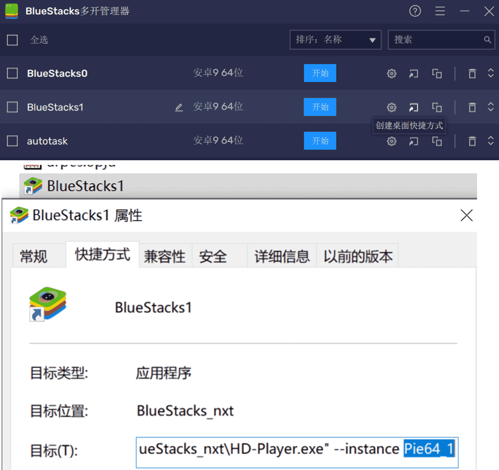
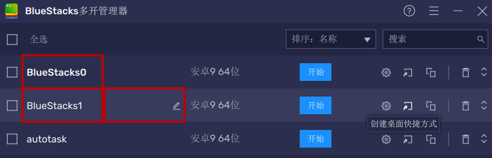

## 配置文件
* 自版本2.2以来,配置文件随着[airtest_mobileauto](https://github.com/cndaqiang/airtest_mobileauto)同步升级为utf8编码的yaml文件.
* 所有基于airtest_mobileauto开发的程序配置文件规则相同.
* **配置文件必须采用yaml语法,可以只配置基础参数,但是不能乱抄别人的配置参数**


## 参数解释
### 基础参数
**基础参数必须设置**

|参数|默认值|含义|
|-|-|-|
|totalnode|1|本脚本一共控制`totalnode`个账户.如双排时设置`totalnode=2`|
|mynode|0|本脚本控制的**账户编号**.**多排组队时不用设置**,由程序自动生成,`mynode=0,1,2,...,totalnode-1`.**单排时可以手动设置为任意值**. |
|multiprocessing|False|自动化多进程组队.**多排组队时一定要设置`multiprocessing=True`**.|
|LINK_dict|None|每个账户所在的模拟器ADB地址`LINK_dict[mynode]="Android:///ip:端口"`.所有账户的ADB地址都要配置.|

#### 单排账户示例

```
mynode: 0
LINK_dict:
  0: Android:///127.0.0.1:5555
```

#### 双排账户示例
```
# 多进程时,多进程的数目
totalnode: 2
# 多进程配置
multiprocessing: True
# 所有账户的ADB地址
LINK_dict:
    0: Android:///127.0.0.1:5555
    1: Android:///127.0.0.1:5557
```


### 调试参数
**调试参数通常无需设置**, 只有在调试代码或者有特定需求时才需要设置

|参数|默认值|含义|
|-|-|-|
|prefix|`""`|程序标志, **推荐设置**为`prefix="WZRY"`, 不设置也没问题. |
|tmpdir|`系统临时目录/airtest_mobileauto/prefix`|airtest_mobileauto运行过程中用于同步等功能的临时文件存储目录,自动生成, **通常无需设置**.  如果在电脑上同时运行了很多脚本,建议为不同的脚本配置不同的`prefix`自动生成`tmpdir`.|
|outputnode|None|只输出账户编号mynode等于outputnode的日志,**无需设置**.|
|logger_level|1|日志等级,`0 DEBUG, 1 INFO, 2 WARNING, 3 ERROR, 4 CRITICAL`,**无需设置**.|
|logfile|None|将每个账户的脚本执行日志输出到指定文件,例如`{mynode:"restul.mynode.txt"}`.**推荐设置**.在脚本总是报错时,可以开启此参数,将运行日志上传到[github](https://github.com/cndaqiang/WZRY/issues)提问.|
|figdir|`assets`|脚本图片资源所在目录,适合[在任意目录运行脚本](../exp/otherdir.md), **通常无需设置**.|

示例
```
# 可以为mynode=0,1,2,...,totalnode-1 每一个账户设置单独的输出
# 也可以只为部分账户,例如0,2设置输出,如下
logfile:
  0: result.0.txt
  2: result.2.txt
prefix: "wzry"
```

### 模拟器参数
* **模拟器参数可以不设置**.
* 设置后,脚本支持控制模拟器的开关机,老板键自动隐藏模拟器等功能.
* 一个配置文件中只能配置一种模拟器.仅需关注自己使用的模拟器参数.

|参数|默认值|含义|
|-|-|-|
|LDPlayerdir|None|雷电模拟器控制程序`ldconsole.exe`所在的文件夹,例如`D:\GreenSoft\雷电模拟器.9.0.65.0.x64.去广告绿色版\LDPlayer`|
|MuMudir|None|MuMu模拟器控制程序`MuMuManager.exe`所在的文件夹,例如`D:\Program Files\Netease\MuMu Player 12\shell`|
|BlueStackdir|None|BlueStack模拟器控制程序`HD-Player.exe`所在的文件夹,例如`C:\Program Files\BlueStacks_nxt`|
|LDPlayer_Instance|{mynode:"instance"}|每个账户所在的模拟器在雷电多开管理器内部的**模拟器实例(instance)编号**, 用于启动、关闭mynode账户所在的模拟器实例. [mynode与instance的区别](#mynode与instance的区别).|
|MuMu_Instance|{mynode:"instance"}|每个账户所在的模拟器在MuMu多开管理器内部的**模拟器实例编号**, 用于启动、关闭mynode账户所在的模拟器实例.[mynode与instance的区别](#mynode与instance的区别).|
|BlueStack_Instance|{mynode:"Nougat32_instance"}|每个账户所在的模拟器在BlueStacks多开管理器内部的**模拟器实例编号**, 用于启动mynode账户所在的BlueStacks模拟器实例.[mynode与instance的区别](#mynode与instance的区别).|
|BlueStack_Windows|{mynode:"BlueStacks App Player instance"}|BlueStacks没有提供关闭模拟器的接口,需要使用windows的命令关闭模拟器实例的窗口名称. **建议在多开管理器里修改为简短的名字**,例如`BlueStacks0`,`BlueStacks1`等|
|BossKey|内置|**无需设置**,airtest_mobileauto内部已经配置了BlueStack/LDPlayer/MuMu模拟器默认的老板键.本脚本启动模拟器后,会自动隐藏模拟器窗口.若自定义了老板键或有更多需求,自行修改airtest_mobileauto的代码.|

#### 雷电模拟器配置
!!! Warning "雷电模拟器"
    图中模拟器的Instance被鼠标选中，其对应的配置文件如下
    <pre><code>
    mynode: 0
    LINK_dict:
      0: Android:///127.0.0.1:5555
    LDPlayerdir: D:\GreenSoft\雷电模拟器.9.0.65.0.x64.去广告绿色版\LDPlayer
    LDPlayer_Instance:
        0: "0"
    </code></pre>
    


#### MuMu模拟器配置
!!! note "MuMu模拟器"
    图中模拟器的Instance被鼠标选中，其对应的配置文件如下
    <pre><code>
    mynode: 0
    LINK_dict:
      0: Android:///127.0.0.1:16384
    MuMudir: D:\Program Files\Netease\MuMu Player 12\shell
    MuMu_Instance:
        0: "0"
    </code></pre>
    

#### BlueStack模拟器配置

!!! Question "BlueStacks"
    图中模拟器的Instance被鼠标选中，其对应的配置文件如下，**注意BlueStacks模拟器要额外提供模拟器的窗口名字`BlueStack_Windows`**
    <pre><code>
    mynode: 1
    LINK_dict:
      1: Android:///127.0.0.1:5565
    BlueStackdir: C:\Program Files\BlueStacks_nxt
    BlueStack_Instance:
        1: "Pie64_1"
    BlueStack_Windows:
        1: BlueStacks1
    </code></pre>
    


#### mynode与Instance的区别
* 账户编号mynode是游戏账户的编号,默认从0开始.`mynode=0,1,2,...,totalnode-1`.
* 模拟器实例编号Instance是模拟器的多开管理器内部的编号.通常也是`0,1,2,...`
* 两者之间的映射关系通过`xxx_Instance`数组指定,`xxx_Instance`是为了控制模拟器的开机关机等模拟器的操作.
* **`mynode=0`的账户必须是多开组队的大号(开房间的账户).但是`mynode=0`的账户可以使用任意一台模拟器**
    <br>例如,下面的配置中,大号(`mynode=0`)使用第1台模拟器,小号(`mynode=1`)使用第0台模拟器
    <pre><code>
    totalnode: 2
    multiprocessing: True
    BlueStackdir: C:\Program Files\BlueStacks_nxt
    BlueStack_Instance:
        0: Pie64_1
        1: Pie64
    BlueStack_Windows:
        0: BlueStacks1
        1: BlueStacks0
    LINK_dict:
        0: Android:///127.0.0.1:5565
        1: Android:///127.0.0.1:5555
    </code></pre>
    

### docker参数
* 本脚本支持控制运行在docker中的安卓模拟器[remote-android](https://github.com/remote-android/).
* 支持x86、arm服务器, openwrt路由器等环境运行安卓模拟器.
* 这是我的完整安装和使用过程: [在甲骨文免费服务器上安装redroid并配置WZRY](../exp/docker.md)

|参数|默认值|含义|
|-|-|-|
|dockercontain|`{mynode: "androidcontainInstance"}`|每个账户所在的容器的容器名称, 用于启动、关闭mynode账户所在的容器.|

!!! Wannring
    remote-android默认开启了root,王者体验服检测root,会封号体验服账户,请勿在docker中安装体验服.

三个账户组队示例
```
# 节点配置
totalnode: 3
multiprocessing: True
LINK_dict:
    0: "Android:///127.0.0.1:5555"
    1: "Android:///127.0.0.1:5565"
    2: "Android:///127.0.0.1:5575"
dockercontain:
    0: "androidcontain0"
    1: "androidcontain1"
    2: "androidcontain2"
```


### IOS配置参数
* ios代码的更新和维护永久停留在版本[1.2.2](https://github.com/cndaqiang/WZRY/releases/tag/1.2.2).
* 请自行[搭建开发环境](https://cndaqiang.github.io/2023/11/10/MobileAuto/)进行调试.