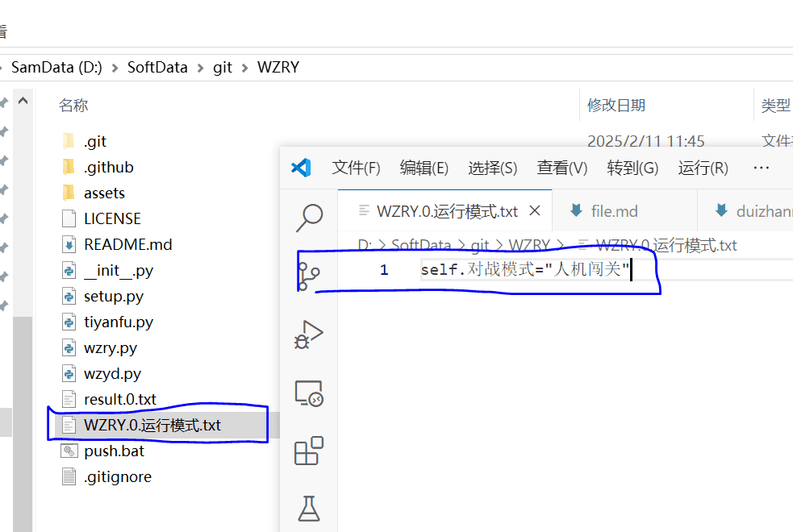

## 说明
若需调整第`mynode`个账户的对战模式

* 则在运行目录,创建`WZRY.mynode.运行模式.txt`文件
* **把`mynode`替换为你的[账户编号](config.md#mynode与instance的区别)**
* 文件为UTF8格式编码, 内容为标准的python语法,不支持超过一行的python语句.


使用**模拟战、人机闯关**等模式时请注意:

* **请务必手动点击，进入一次对战界面，比如第一次时都会有非常多的提示让你去确定**
* 脚本没必要处理这些一次性的内容，请手动点一遍
* **建议打开游戏开关:设置>操作>快捷技能加点|快捷装备购买**
!!! info "目前支持的对战模式包括"
    <pre><code>
    self.青铜段位 = False # True 则进行青铜人机,False进行星耀人机
    self.标准模式 = False # True 则进行标准人机,False进行快速人机
    self.触摸对战 = False # True 则在对战过程自动平移、平A、买装备等真人的操作.
    self.对战模式 = "5v5匹配" # 目前支持 "5v5匹配"(人机5v5), "模拟战"(王者模拟战), "人机闯关"(人机闯关、鸡肋且存在被举报风险请慎重使用)
    self.组队模式 = True # 是否进行组队, totalnode > 1时默认组队.
    </code></pre>


## 根据对局次数选择对战模式
* `self.runstep`,本脚累计运行了多少次对战
* `self.jinristep`,本脚本次运行了多少次对战

示例前2局标准对战并移动, 在`WZRY.mynode.运行模式.txt` 中填写
```
self.标准模式 = self.触摸对战 = False
if self.jinristep <= 2: self.标准模式 = self.触摸对战 = True
```

第5到第10局进行模拟战、第10局以上用人机闯关示例
```
if self.jinristep > 5:  self.对战模式 = "模拟战"
if self.jinristep > 10:  self.对战模式 = "人机闯关"
```

## 如何设计符合自己账户的对战模式

|对战模式|特点|作用|
|-|-|-|
|`self.对战模式 = "5v5匹配"`<br>`self.触摸对战 = False`<br>`self.青铜段位 = True`<br>`self.标准模式 = False`|挂机托管,击杀人头多,<br>可以获得金牌<br>**不满足某些活动的非挂机要求**|**万金油模式**<br>**每日任务专用**,<br>**击杀N名英雄任务专用**,<br>新号刷熟练度<br>可以刷除了付费英雄外的**所有英雄**、<br>刷友情币|
|`self.对战模式 = "5v5匹配"`<br>`self.触摸对战 = True`<br>`self.青铜段位 = True`<br>`self.标准模式 = True`<br>`self.组队模式 = True`|**必过挂机检测**,<br>**对局非常慢**,<br>满足`99.99999%`的任务需求|**补全上一万金油模式的漏网任务**,<br>**做送免费皮肤活动专用**<br>每天组队打一场就行|
|`self.对战模式 = "5v5匹配"`<br>`self.触摸对战 = True`<br>`self.青铜段位 = True`<br>`self.标准模式 = False`|对局慢、**胜率最低**<br>**每局可以获得最多的金币**<br>对局越慢金币越多|**快速获得本周的金币上限**<br>**需要立刻获得3k+金币专用**|
|`self.对战模式 = "5v5匹配"`<br>`self.触摸对战 = False`<br>`self.青铜段位 = False`<br>`self.标准模式 = False`|对局慢、星耀对局上限10次|**老号专用**,<br>蓝色熟练度提升到红色熟练度|
|`self.对战模式 = "人机闯关"`|速度快、胜率高、0人头|适合刷对战次数任务,<br>**最快刷熟练度**<br>(但是**只能刷自己有的英雄**)、<br>赛季对局次数任务<br>组队刷友情币、亲密关系|
|`self.对战模式 = "模拟战"`|刷信誉分|**唯一支持提升信誉分的模式,<br>每期战令的20局娱乐任务**|
|`self.对战模式 = "火焰山"`|**扣信誉分专用**|**不被扣信誉分,<br>就加一点信誉分**|


针对上面的特点，我的个人对战模式设计
```
wzydday = 3 # 周一到周四(wzydday)，以营地任务为主, 王者对局不要赢
#每天组队打0,1,2,...,nstep-1共nstep场，组队5v5匹配&触摸, 日活检测
#每天单人打0,1,2,...,ostep-1共ostep场，模拟战|单人5v5匹配&星耀人机|人机闯关
nstep=2
ostep=1 if self.Tool.time_getweek() < wzydday  else 10 #10局是星耀人机的最大次数
#对战模式: 
if self.jinristep <= nstep: self.对战模式 = "5v5匹配"
if self.jinristep <= nstep: self.标准模式 = self.触摸对战 = self.青铜段位 = True
#前wzydday天不可以赢, 所以用模拟战刷信誉分. 超过wzydday,就可以为老号刷熟练度(5v5星耀人机)或者新号刷熟练度(人机闯关)
if self.Tool.time_getweek() < wzydday and self.jinristep > nstep: self.对战模式="模拟战"
if self.Tool.time_getweek() >= wzydday and self.jinristep > nstep: self.对战模式="5v5匹配"
if self.Tool.time_getweek() >= wzydday and self.jinristep > nstep and self.mynode == 1 : self.对战模式="人机闯关"
if self.jinristep  > nstep: self.标准模式 = self.触摸对战 = self.组队模式 = False
if not self.组队模式 and self.totalnode_bak > 1: self.Tool.touchfile(self.无法进行组队FILE,"非组队模式 or nstep对战结束")
#
```


## 人机闯关
如果不想使用助手, 每天**用手打游戏**如何最快的完成日活要求呢？人机闯关是最合适的模式.

* 5个真人从中路直接推水晶, 手打2分钟以内结束一把
* 两局就可以完成日活的对战要求
* 进行人机闯关的基本都是做任务的，所以对局结束后经常有人邀请你组队闯关，你也可以邀请别人组队（完成组队任务）
* 对战结束后务必选择返回大厅，重新进入第一关，后面的关卡难度高而且没人，

在使用本助手运行时，也可以开启人机闯关模式`self.对战模式 = "人机闯关"`

* 本助手的人机闯关模式支持自己的大号和小号组队, 默认对局结束返回大厅重新进入第一关.
* **因为4个队友都是真人, 所以半夜或者其他阴间时间可能匹配不到人!!!**
* **因此在使用本助手的人机闯关模式时请选择正常玩家在线比较多的时间**
* 人机闯关打的多了，可以看到很多在泉水平A回城的脚本号.
* 系统不会主动处罚挂机账户，但是4个队友都是真人,所以他们可能会举报.
* 我举报过别的挂机用户, 系统都没有扣分
* **以后是否会扣信誉分,请自行验证并为自己的账户负责**

> * **人机闯关模式,对战速度快,胜率高,简直是最适合刷熟练度的模式, 但其用处也仅限于刷熟练度了**
> * **人机闯关必须采用触摸模式,所以无法获得金牌,无法替换挂机模式的每日任务， 也不能为两局标准触摸组队模式节省多少时间.**
> * 如果是为了刷日活还是要用默认的`self.对战模式 = "5v5匹配"`
> * **但是人机闯关只能刷自己金币已经购买的英雄, 而"5v5匹配"可以刷所有的英雄, 对于新号好像还是"5v5匹配"更全能一些**


开启人机闯关模式的方法: 

* **请务必手动点击，进入一次人机闯关的房间, 会有非常多的提示让你去确定**
* 在运行目录,创建`WZRY.mynode.运行模式.txt`文件, 填入`self.对战模式 = "人机闯关"`, 如下图




## 模拟战
* `self.对战模式 = "模拟战"`
* 细节见[自动刷信誉分](../exp/xinyufen.md)


## 其他模式
* 在wzry.py中搜索`self.对战模式`,自行探索隐藏的对战模式
* 这些没有公开的模式，都是有风险的.
* 比如 `self.对战模式 = "火焰山"`. 没被举报就加信誉分,被举报就**扣信誉分**. 