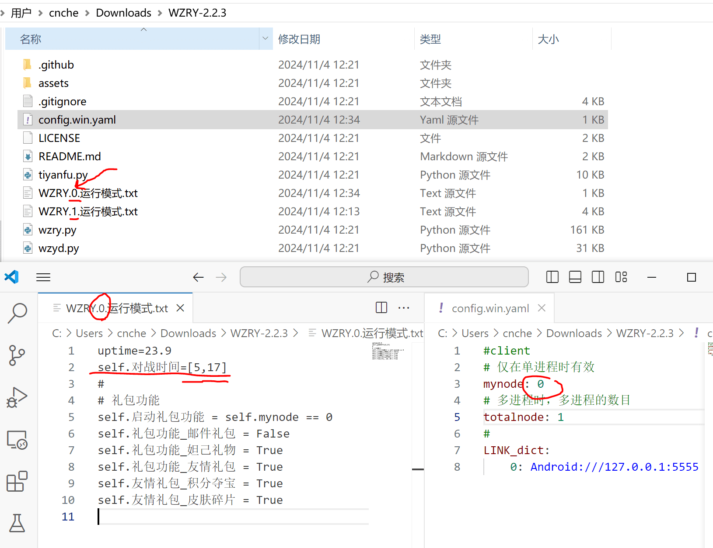

## 说明
* **通过创建一些文件来精细的操作代码的运行**
* **所有文件都放在`wzry.py`所在路径,采用txt结尾,UTF8格式编码**
* 文件内容为标准的python语法,不支持超过一行的python语句.

## 文件名及推荐填写的参数

|文件名|推荐填写的控制命令|
|-|-|
|`WZRY.mynode.运行模式.txt`    | 自定义脚本的运行模式：[运行时间](#控制运行时间示例)、[礼包功能](libao.md)、[对战模式](duizhanmoshi.md)、[选择英雄](shuliandu.md)等,**按需使用**, <br>**注意此处的mynode代表[账户编号](config.md#mynode与instance的区别), 需要为每个账户单独配置**, 即`WZRY.0.运行模式.txt,WZRY.1.运行模式.txt,...` <br>如何修改一个控制文件并对所有账户生效见[多账户使用同一个控制文件](../exp/link.md) |
|`WZRY.mynode.调试文件.txt`    | 调试文件, 用于测试某项功能是否正常, **不要使用**.|
|`WZRY.图片更新.txt`           | 更新静态资源图片, 所有账户使用同一个文件, 不区分mynode, 用于[活动更新图片](upfig.md)、设置组队的[房主头像](zudui.md)等需要更新识别图片的功能,使用教程[图片更新](tupiangengxin.md),**按需使用**|


## 控制运行时间示例
mynode=0的账户，仅在每天的5点到17点执行脚本,在`WZRY.0.运行模式.txt`中添加
```
self.对战时间=[5,17]
```



每天只对战5局,则在`WZRY.mynode.运行模式.txt` 中填写
```
if self.jinristep >  5:  self.对战时间[0]=0.1
if self.jinristep >  5:  self.对战时间[1]=0.2
```

## 更多命令
* [对战模式](duizhanmoshi.md)
* [礼包功能](libao.md)
* [选择英雄](shuliandu.md)
* [图片更新](tupiangengxin.md)