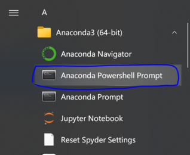
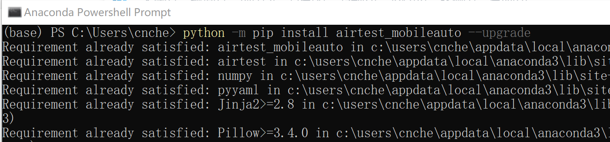

我是Python新手, 不了解ADB, 暂时没时间阅读下面的教程, 点击[新手教程🔗](../guide/tuwen.md).


## 安装模拟器和登陆游戏 
* **推荐将游戏安装到[BlueStack/LDPlayer/MuMu模拟器](../exp/moniqi.md)中**.
* 模拟器的分辨率设置为`960x540`,dpi为`160`.
* **开启模拟器的ADB调试**
* **安装王者、扫码登录账号, 下载所有游戏资源, 并手动进入游戏大厅**.

!!! Note "其他建议"
    * **不要在模拟器上安装登录微信**, 详情搜索*模拟器封微信*, 扫码登录游戏没有任何风险.
    * **关闭模拟器的root**, 本脚本不需要root权限, root会封禁体验服的账户.
    * 在新设备/模拟器上登录游戏账号, **首次**进入人机房间、战令、战队、KPL赛事、领取各种礼包等界面时,<br>王者总会有各种**弹窗**、强制观看视频等.
    * 本脚本虽然能够处理这些弹窗, 但是极其的浪费时间.
    * 更新完游戏资源,并手动进入过上述界面关闭弹窗后, 可以大大加速脚本的执行速度.
    * 如果不想使用模拟器, 请阅读[控制安卓手机或任意模拟器](../exp/mobile.md).
    * 如果不想使用电脑, 请阅读[只用一部手机、不依赖电脑运行自动化脚本](../exp/termux.md)


## 配置环境
### 安装 Python

* Python新手, 推荐安装Anaconda(可以到[TUNA](https://mirrors.tuna.tsinghua.edu.cn/anaconda/archive/)下载最新的安装包)
* Python老手, 用你喜欢的Python就行.

### 安装依赖

* 打开终端(若安装了Anaconda, 打开`Anaconda Powershell Prompt`), 执行:

```
python -m pip install airtest_mobileauto --upgrade
```

* 如果无法更新`airtest_mobileauto`, 请查看[Q&A:没法安装airtest_mobileauto](../qa/qa.md#没法安装airtest_mobileauto)





## 下载代码
* 打开[https://github.com/cndaqiang/WZRY](https://github.com/cndaqiang/WZRY)
* **点击右上角的star👻立刻获得免费下载资格.**
* 如果无法访问github, 请查看[Q&A:没办法下载WZRY代码](../qa/qa.md#没办法下载wzry代码)

### 核心程序
* 从Releases页面下载最新的[Source code (zip)](https://github.com/cndaqiang/WZRY/releases).
* 解压到`WZRY-x.x.x`(x.x.x为版本号).**请务必使用最新版本`x.x.x>=2.2.9`**

### 更新资源
* **通常是不需要更新的**. 王者重大活动期间, 例如周年庆,才需要**临时**更新.
* **更新判据: 如果大厅的对战图标不是,就需要更新**
* 在**[更新资源](upfig.md)**页面可以获得更新资源的方法.


## 运行方式

### 方式1. 直接运行
* 当模拟器的ADB地址是`127.0.0.1:5555`时, 可以直接运行脚本`python -u wzry.py`
* **直接运行报错或者遇到各种问题,请[使用配置文件运行](#方式2-使用配置文件运行)**
* 打开支持python的终端(安装Anaconda后,打开`Anaconda Powershell Prompt`), 执行:
```
# 进入代码目录
cd D:\Download\WZRY-2.2.9.3
# 执行脚本
python -u wzry.py
```


### 方式2. 使用配置文件运行
> 当需要多排组队、直接运行报错、或者遇到无法连接模拟器等各种异常问题时, 需要在[配置文件](config.md)中配置模拟器的参数.
详见[配置文件的写法](config.md).


MuMu模拟器使用配置文件示例

* 在模拟器的设置里查看ADB的地址为`127.0.0.1:16384`
* 在代码目录创建`config.win.yaml`,填入下面内容
```
mynode: 0
LINK_dict:
    0: Android:///127.0.0.1:16384
```
* 打开支持python的终端(安装Anaconda后,打开`Anaconda Powershell Prompt`), 执行:
```
# 进入代码目录
cd D:\Download\WZRY-2.2.9.3
# 执行脚本
python -u wzry.py config.win.yaml
```


### 方式3. 在vscode等软件中
* 创建配置文件`config.win.yaml`,同上
* 修改`wzry.py`中的`config_file = ""`为`config_file = "config.win.yaml"`
```
if __name__ == "__main__":
    # 如果使用vscode/pycharm/AirTestIDE等图形界面程序运行此脚本
    # 在此处指定config_file=config文件
    config_file = "" # 修改此处
    if len(sys.argv) > 1:
        config_file = str(sys.argv[1])
```
* 运行