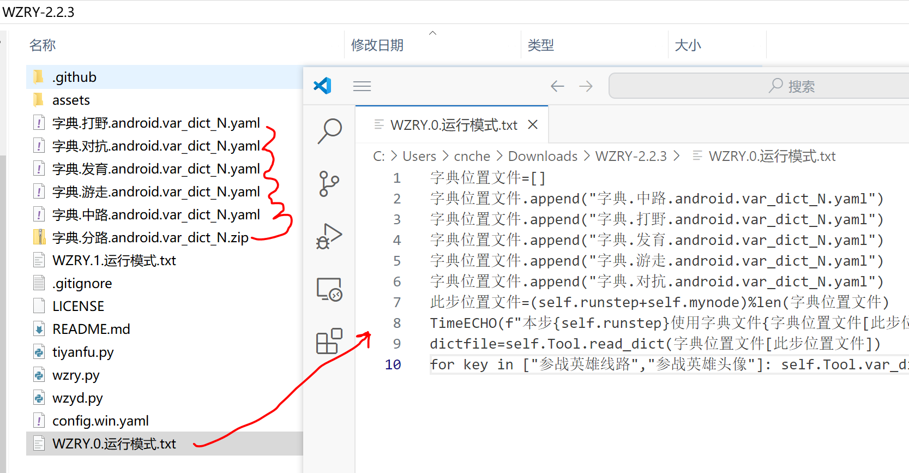
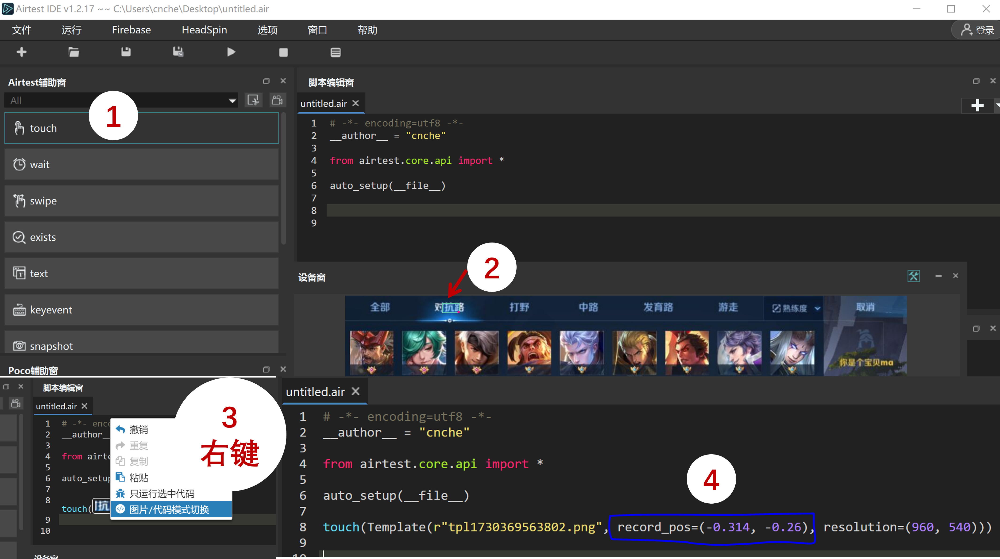

## 说明
若需调整第`mynode`个账户的对战分路和英雄

* 则在`wzry.py`所在的文件夹,创建`WZRY.mynode.运行模式.txt`文件
* **把`mynode`替换为你的[账户编号](config.md#mynode与instance的区别)**
* 文件为UTF8格式编码, 内容为标准的python语法,不支持超过一行的python语句.

## 循环选熟练度最低的英雄
* 提前在选英雄界面设置为*熟练度*排序,而不是*赛季常用*等选项

### 方法1. 读入英雄绝对坐标
在`WZRY.mynode.运行模式.txt`文件内填入
```
字典位置文件=[]
字典位置文件.append("字典.中路.android.var_dict_N.yaml")
字典位置文件.append("字典.打野.android.var_dict_N.yaml")
字典位置文件.append("字典.发育.android.var_dict_N.yaml")
字典位置文件.append("字典.游走.android.var_dict_N.yaml")
字典位置文件.append("字典.对抗.android.var_dict_N.yaml")
此步位置文件=(self.runstep+self.mynode)%len(字典位置文件)
TimeECHO(f"本步{self.runstep}使用字典文件{字典位置文件[此步位置文件]}")
dictfile=self.Tool.read_dict(字典位置文件[此步位置文件])
for key in ["参战英雄线路","参战英雄头像"]: self.Tool.var_dict[key]=dictfile[key]
```

下载[字典.分路.android.var_dict_N.zip](../file/字典.分路.android.var_dict_N.zip).解压在脚本目录


!!! Note
    我提供的字典文件[字典.分路.android.var_dict_N.zip](../file/字典.分路.android.var_dict_N.zip)仅作示例并停止更新.<br>
    当出现新英雄时,该字典不会选择新英雄.<br>
    如果你的分辨率不是960x540也不要使用这个字典.<br>
    这两种情况你应该计算出适配你账户的`参战英雄线路`和`参战英雄头像`的绝对坐标. 然后填写到对应的`字典.分路.android.var_dict_N.yaml`文件中.<br>
    [计算绝对坐标的步骤](#计算绝对坐标的步骤)

#### 计算绝对坐标的步骤
在选择英雄界面,使用AirtestIDE截取分路的中心位置




可以得到这样一串代码

```
touch(Template(r"tpl1730369563802.png", record_pos=(-0.314, -0.26), resolution=(960, 540)))
```

利用**相对坐标**`record_pos`和**屏幕分辨率**`resolution`计算新分路的绝对坐标
```
record_pos=(-0.314, -0.26)
resolution=(960, 540)
x = 0.5*resolution[0]+record_pos[0]*resolution[0]
y = 0.5*resolution[1]+record_pos[1]*resolution[0]
pos = (x, y)
```
将计算得到`(x,y)`填到`字典.分路.android.var_dict_N.yaml`文件中
```
参战英雄线路: !!python/tuple
- x
- y
```

新英雄的位置同理,务必选择英雄头像中间的区域,越小`record_pos`越精准. 当王者因为其他活动更改界面时，同样可以这样手动修改`android.var_dict_mynode.yaml`中的坐标(例如大厅的[战令入口、商店入口、活动入口](../QA.md#进入不了战令页面)的位置经常变,而且图标也跟着宣传海报变，不修改代码的前提下，直接修改记录位置的`android.var_dict_mynode.yaml`是最快的).


### 方法2. 计算英雄相对坐标
!!! tip
    在你已经熟练掌握方法1, 并且理解了逻辑之后.其实,我们完全可以把坐标直接写在`WZRY.mynode.运行模式.txt`里面.<br>
    对于**分辨率960x540,dpi=160**的模拟器, 使用 *[方法1中的计算绝对坐标的步骤](#计算绝对坐标的步骤)* 可以发现：<br>
    对角线上的两个英雄之间的相对坐标`record_pos`差约为`(0.09,0.11)`。<br>
    第1列第1行的英雄的record_pos为`(-0.45,-0.2)` <br>
    英雄列表共`(9列,5行)`, 第`i`列第`j`行的英雄坐标为`(-0.54+i*0.09,-0.31+j*0.11)`. <br>
    如果你使用分辨率960x540,dpi=160的模拟器,可以直接抄我下面的配置,填到的`WZRY.mynode.运行模式.txt`中。

```
# 打野和对抗不要相邻, 组队的时候容易英雄冲突
分路名称=["对抗", "中路","发育","打野","游走"]
index=(self.runstep+self.mynode)%len(分路名称)
TimeECHO(f"本次{self.runstep}对战分路: {分路名称[index]}")
#
# 第(列,行)的英雄位置
pos=[(6,5),(4,4),(9,2),(9,5),(2,4)][index]
参战英雄头像坐标=(-0.54+pos[0]*0.09,-0.31+pos[1]*0.11)
参战英雄线路坐标=[(-0.314, -0.26), (-0.069, -0.26), (0.037, -0.26),   (-0.194, -0.26), (0.18, -0.26)][index]
self.Tool.cal_record_pos(参战英雄头像坐标, self.移动端.resolution, "参战英雄头像", savepos=True)
self.Tool.cal_record_pos(参战英雄线路坐标, self.移动端.resolution, "参战英雄线路", savepos=True)
```

!!! Danger
    该功能也可以用于刷特定分路、特定的英雄(此时不能按照熟练度排序). 即直接设置`pos`和`参战英雄线路坐标`的值.
    **其他分辨率的设备,请使用AirtestIDE截图获得`record_pos`后,计算自己的坐标规则**.


## 选择特定分路和英雄
* 对于**分辨率960x540,dpi=160**的模拟器,在`WZRY.mynode.运行模式.txt`文件内填入下面内容,则会选中对抗路和第6列第5行的英雄.
* 其他的分辨率,阅读上面的*循环选熟练度最低的英雄*内容, 就知道怎么操作了.


```
pos=(6,5)
参战英雄头像坐标=(-0.54+pos[0]*0.09,-0.31+pos[1]*0.11)
参战英雄线路坐标=(-0.314, -0.26)
self.Tool.cal_record_pos(参战英雄头像坐标, self.移动端.resolution, "参战英雄头像", savepos=True)
self.Tool.cal_record_pos(参战英雄线路坐标, self.移动端.resolution, "参战英雄线路", savepos=True)
```