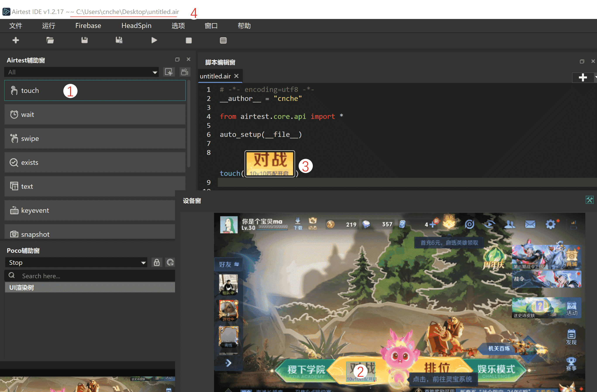
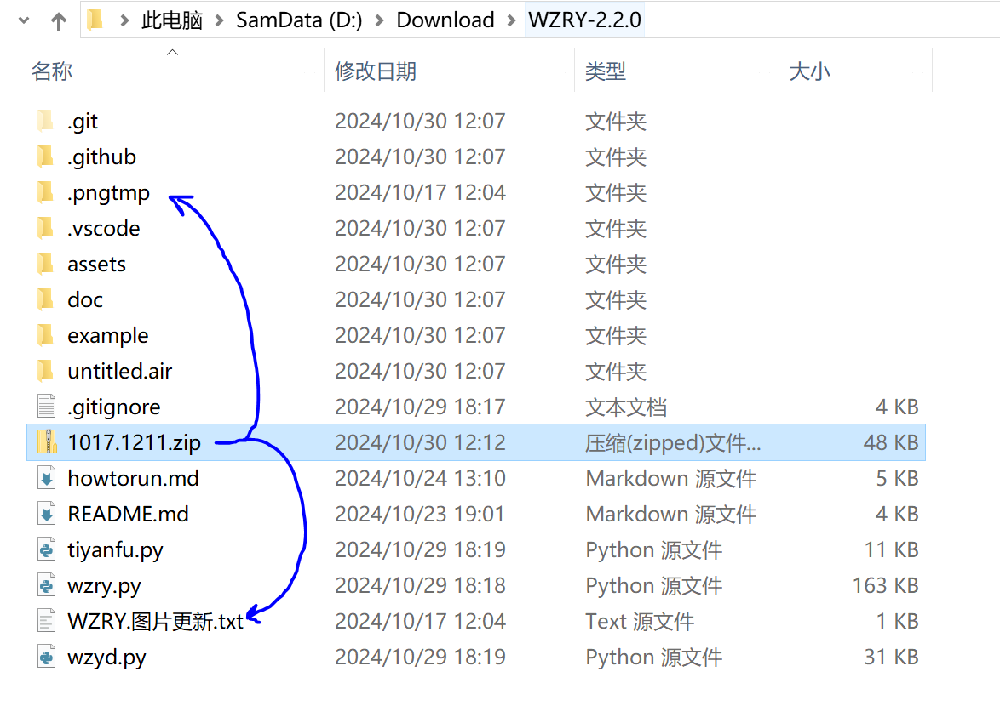

## 说明
若需更新图片资源

* 则在运行目录,创建`WZRY.图片更新.txt`文件
* 文件为UTF8格式编码, 内容为标准的python语法,不支持超过一行的python语句.


??? question "为何要更新图片?"
    王者因为各种活动，会临时改变登录页面的开始游戏、大厅的对战和娱乐模式、匹配房间的开始游戏和取消准备、大厅的战令、商店、活动入口等的图片资源.
    而在活动结束时, 这些图片又会恢复成默认的图片.  <br>每次活动都更新[WZRY代码仓库](https://github.com/cndaqiang/WZRY)的静态图片没有意义.
    本脚本提供一种临时更新图片的方法, 当文件`WZRY.图片更新.txt`存在时, 则会使用这个文件中定义的图片覆盖掉默认的设置, 当该文件不存在时, 则恢复默认的图片.<br>
    在[组队](../guide/zudui.md)的时候，不同账户的头像不同, 也可以将[房主头像](../guide/zudui.md#更新房主头像)定义在`WZRY.图片更新.txt`中.


## 更新图片示例
* 单张图片通过[Template](#template代码格式)定义, 可以使用`self.XXXX=Template(...)`进行赋值
* 图片数组, 例如`self.大厅元素`有很多个图片, 只要存在一张就说明是在大厅, 通过`self.XXX.append(Template(...))`进行添加
* 下面代码为`WZRY.图片更新.txt`中实际内容示例

```
# 游戏界面的图片
self.登录界面开始游戏图标=Template(r"tpl1729136317897.png", dirname = ".pngtmp",record_pos=(0.105, 0.231), resolution=(960, 540))
self.大厅对战图标=Template(r"tpl1729136353514.png", dirname = ".pngtmp",record_pos=(-0.102, 0.142), resolution=(960, 540))
self.大厅万象天工 = Template(r"tpl1729136360109.png", dirname = ".pngtmp",record_pos=(0.263, 0.139), resolution=(960, 540))
self.房间中的开始按钮图标.append(Template(r"tpl1729136921399.png", dirname = ".pngtmp",record_pos=(0.106, 0.233), resolution=(960, 540)))
self.房间中的取消按钮图标.append(Template(r"tpl1729136898325.png", dirname = ".pngtmp", record_pos=(0.102, 0.233), resolution=(960, 540)))
self.大厅元素.append(self.大厅对战图标)
self.大厅元素.append(self.大厅万象天工)
# 组队使用
self.房主头像 = Template(r"tpl1716782981770.png", dirname = ".pngtmp",record_pos=(0.354, -0.164), resolution=(960, 540), target_pos=9)
self.房主房间 = Template(r"tpl1700284856473.png", dirname = ".pngtmp",record_pos=(0.312, -0.17), resolution=(1136, 640), target_pos=2)
```


## Template代码格式
在`WZRY.图片更新.txt`中添加图片格式的代码通常为
```
self.房主头像 = Template(r"tpl1716782981770.png", dirname = ".pngtmp",record_pos=(0.354, -0.164), resolution=(960, 540), target_pos=9)
```

`Template`一个图片的类, 在[airtest-mobileauto](https://github.com/cndaqiang/airtest_mobileauto)中定义, 在airtest原版的`Template`的基础上增加了一些功能(例如`dirname = ".pngtmp"`,代表图片放置的路径,本示例中图片在`.pngtmp`文件夹中)

`Template`原版的解释可以见[airtest官方教程](https://airtest.doc.io.netease.com/IDEdocs/airtest_framework/3_airtest_image/), 下面是简短介绍

* `r"tpl1716782981770.png"`, 图片的名字`tpl1716782981770.png`
* `record_pos=(0.354, -0.164)` 图片的相对坐标
* `resolution=(960, 540)` 模拟器的分辨率
* `target_pos=9`, 当识别成功后, 点击图片的哪个区域, 如下图. 适合于图片元素比较小(如进房、组队等各种小图标), 截取小区域容易失败 需要截取一个较大的面积进行识别, 然后点击这个大图片中的指定区域. <br>


## 截取新图片的流程
当发现王者活动更新了`大厅对战图标`(或者任何图片资源), 而本文档又没有及时提供[更新资源](../guide/upfig.md),你就可以自己动手更新了.具体流程如下图

* 打开游戏到大厅
* AirtestIDE连接设备
* (1) touch
* (2) 截图对战图标. (既不能过大，又要有辨识度，可以在wzry.py中搜索`self.大厅对战图标`, 然后在assets文件夹看我截取的范围)
* 复制生成的代码(3), 如`touch(Template(r"tpl1730865263724.png", record_pos=(-0.101, 0.147), resolution=(960, 540)))`,**不要复制`touch`, 只复制`Template(...)`这部分**
* 去(4)的文件夹把图片`tpl1730865263724.png`复制到**运行目录**(通常是`wzry.py`所在的文件夹)
* 添加`self.大厅对战图标=Template(r"tpl1730865263724.png", record_pos=(-0.101, 0.147), resolution=(960, 540))`到`WZRY.图片更新.txt`
* 建议在**运行目录**创建`.pngtmp`文件夹,然后把图片`tpl1730865263724.png`复制到`.pngtmp`文件夹，此时代码**要添加`dirname = ".pngtmp",`**<br>
 即`self.大厅对战图标=Template(r"tpl1730865263724.png", dirname = ".pngtmp", record_pos=(-0.101, 0.147), resolution=(960, 540))`<br>
这样所有的图片都在`".pngtmp"`目录, 代码目录会比较干净




其他的图片, 截取步骤同上. 本文档零零散散在各个页面也有截图教程, 善用文档的搜索功能,例如

* [截取对战分路和英雄](../guide/shuliandu.md#计算绝对坐标的步骤)
* [组队设置房主头像](../guide/zudui.md#更新房主头像)
* [截取战令入口](../qa/qa.md#进入不了战令页面)


## 最终效果
最终更新之后的代码目录为一个`WZRY.图片更新.txt`文件, 和存放所有更新图片的`.pngtmp`文件夹
