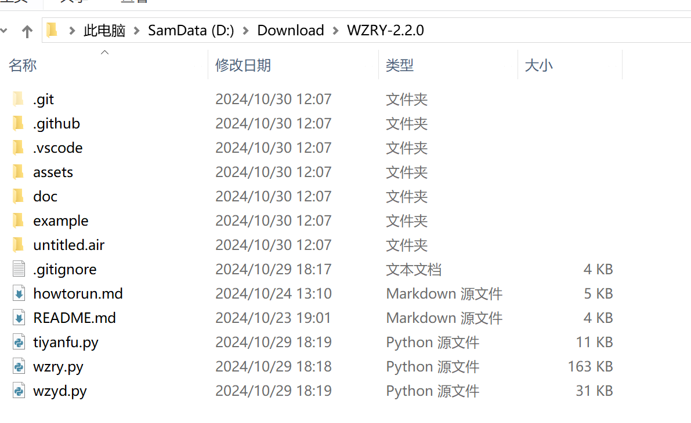
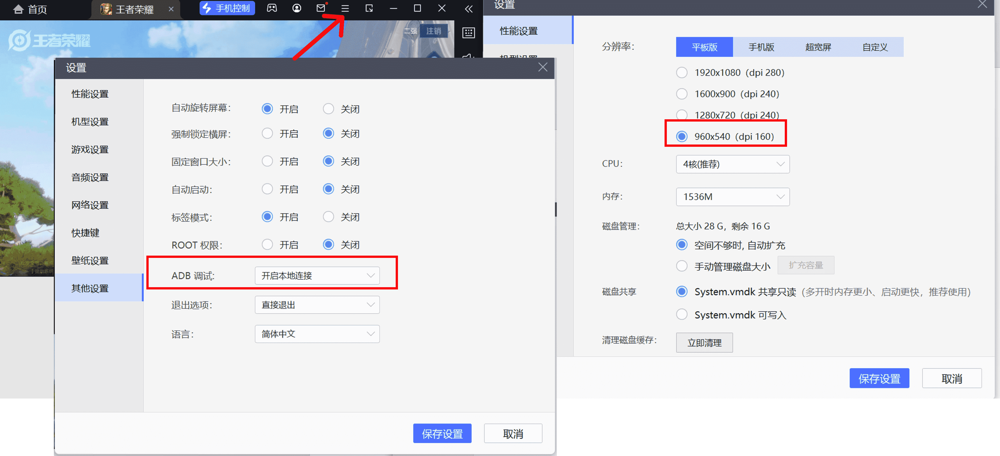
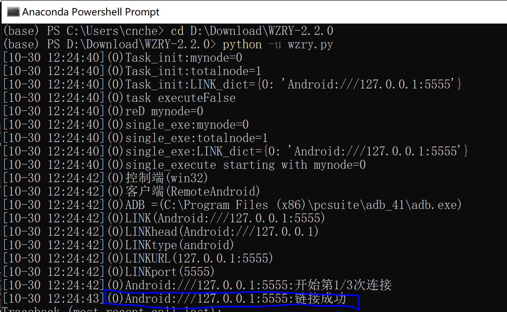

## 说明
* 新手教程只适合小白用户快速上手
* 务必每一步都和下面的操作一样
* **如果新手教程失败, 请尝试默认的[安装指南](../guide/install.md).**

## 安装Anaconda.
* Anaconda 安装包可以到[TUNA](https://mirrors.tuna.tsinghua.edu.cn/anaconda/archive/)下载.
* 就下载最新的 https://mirrors.tuna.tsinghua.edu.cn/anaconda/archive/Anaconda3-2024.10-1-Windows-x86_64.exe
* 安装

## 安装依赖
* 打开`Anaconda Powershell Prompt`后执行
```
python -m pip install  -i https://mirrors.tuna.tsinghua.edu.cn/pypi/web/simple  airtest_mobileauto --upgrade
```


## 下载
* 打开[https://github.com/cndaqiang/WZRY](https://github.com/cndaqiang/WZRY),  **点击右上角的star👻.**
* 如果无法访问[https://github.com/cndaqiang/WZRY](https://github.com/cndaqiang/WZRY), 请查看[Q&A:没办法下载WZRY代码](../qa/qa.md#没办法下载wzry代码)
* 点击右下角的release, 即[https://github.com/cndaqiang/WZRY/releases](https://github.com/cndaqiang/WZRY/releases)页面,  下载最新的Source code (zip).
* 解压到`WZRY-x.x.x`(x.x.x为版本号).**请务必使用最新版本`x.x.x>=2.3.0`**. 


本次演示版本为`WZRY-2.2.0`(**请务必使用最新版本**, 不要下载2.2.0这个老版本)



## 更新资源
* **通常是不需要更新资源的**.
* WZRY有特殊活动(比如周年庆)时,登陆界面的对战按钮等图片元素会改变, 此时需要**临时**更新这些图片.
* 若**[更新资源](upfig.md)**提示需要更新资源, 则需要更新
??? Note "点击展开:更新资源示意图"
    


## 安装雷电模拟器
* **确保你的电脑上没有其他模拟器在运行**
* **全新安装雷电模拟器并打开**,并设置分辨率,dpi,并开启ADB调试, **参数必须和图片中一致**.



## 安装王者荣耀APP到雷电模拟器
* 安装王者荣耀APP
* 更新游戏
* 登录账号
* **手动进入大厅,关闭活动提示**

## 运行wzry.py
* **确保你的电脑只有雷电模拟器这一个安卓模拟器在运行**
* **确保已安装游戏并进入大厅**
* **确保模拟器的分辨率是960x540,dpi=160,开启了ADB**

* 打开`Anaconda Powershell Prompt`后执行
```
cd D:\Download\WZRY-2.2.0
python -u wzry.py
```



* **如果最后没有连接成功,请尝试默认的[安装指南](../guide/install.md).**