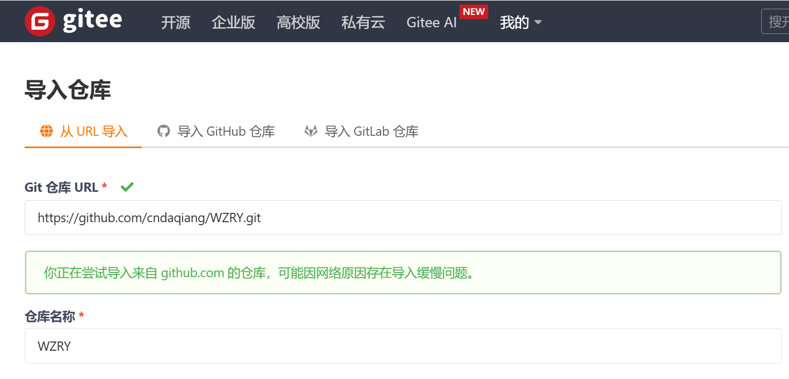
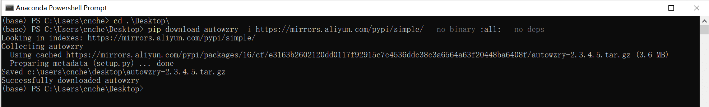
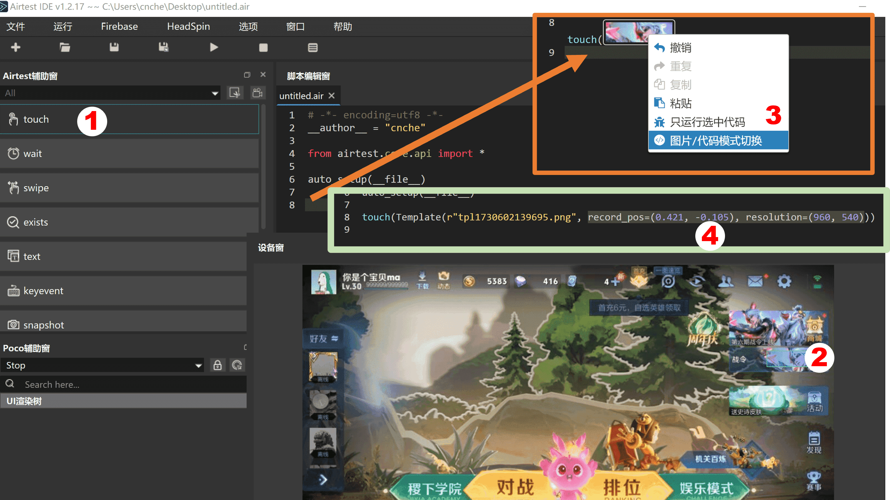
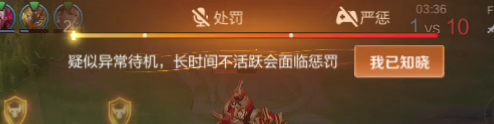

## 如果你在运行时遇到问题
* 使用页面最上方的搜索功能
* 其次认真阅读使用手册
* 你的问题可能已经被修复了, 务必使用**最新的代码**[releases](https://github.com/cndaqiang/WZRY/releases)
* 其实你读读源码`wzry.py`能解决你99%的问题
* 在[issues](https://github.com/cndaqiang/WZRY/issues)页面**友善**的提出问题.


???Note "如何提问能得到最快的解答?"
    * **为[WZRY](https://github.com/cndaqiang/WZRY)star**, 为[使用手册wzry.doc](https://github.com/cndaqiang/wzry.doc)star
    * 使用issue模板进行提问.
    * 语气和善,没人理会你的傲慢和懒惰.


## 没法安装airtest_mobileauto
Q:

* 安装哪个版本？
* 无法pip安装airtest_mobileauto
* 下载速度缓慢?
* conda python3.13.1装不上airtest_mobileauto。python3.12装了airtest_mobileauto，但是装不了Minicap和Javacap

A:

* 安装最新的版本
* 数十位用户反馈都可以正常安装, 使用python 3.10/3.11/3.13全部可以运行通过, 应该**与python版本没有关系**
* 安装不成功大概率是安装的python有问题, **使用anaconda重新安装python**
* 如果因为网络无法安装, 打开科学上网或者使用镜像源[mirrors.cernet.edu.cn等](https://mirrors.cernet.edu.cn/pypi/web/simple)进行安装


```
python -m pip install  -i https://mirrors.cernet.edu.cn/pypi/web/simple  airtest_mobileauto --upgrade
#如果上面的依然很慢, 就用下面的命令(去掉#)
#python -m pip install  -i https://mirrors.aliyun.com/pypi/simple/  airtest_mobileauto --upgrade
```

* 如果安装过程中强制停止等原因导致再次安装时报错`These packages do not match the hashes from the requirements file`等
* 这是python相关的问题, 向搜索引擎提问吧, 没有统一的解决办法, 可以试试下面的命令

```
python -m pip install  --no-cache-dir  airtest_mobileauto --upgrade
```


## 没办法下载WZRY代码
Q:

* 不会魔法上网, 也无法访问github? 无法下载脚本?
* 打不开下载页面/进不去github网页
* 下载速度缓慢?

A:

* b站搜索如何访问github
* 万能方法. 使用[gitee](https://gitee.com/)导入WZRY的仓库:<br> `https://github.com/cndaqiang/WZRY.git`

* 镜像站方法, 使用公益的镜像站进行下载, 例如<br> `https://github.moeyy.xyz/https://github.com/cndaqiang/WZRY/archive/dev.zip`
* Python终端下载方法., 
<br>`pip download autowzry -i https://mirrors.cernet.edu.cn/pypi/web/simple --no-binary :all: --no-deps`
<br>或者`pip download autowzry -i https://mirrors.aliyun.com/pypi/simple/  --no-binary :all: --no-deps`
<br>详见[从pypi镜像站下载WZRY代码](../exp/pypi.md)

* **等你可以访问github时, 欢迎你来为[WZRY](https://github.com/cndaqiang/WZRY)项目点赞.**

## `模块 [airtest_mobileauto] 导入失败`
Q:

* 新版本的Python（我用的是比较新的3.13）可能会遇到没有“distutils”的情况
* 然后如果没有“distutils”模块，你脚本里的提示仍然是让他安装airtest_mobileauto
* 安装 airtest_mobileauto 失败, 有一些依赖安装失败

A:

* 应该是你安装airtest_mobileauto过程中网络或者强制停止等操作出现了问题, 没能安装distutils等依赖
* 下面是我使用python3.13时的安装过程, 没有遇到任何问题

```
conda create -n myenv python=3.13
conda activate myenv
pip install autowzry
```

## airtest_mobileauto和airtest是什么关系

* [airtest_mobileauto](https://pypi.org/project/airtest-mobileauto/) 就是在 airtest 上面套了层壳, 最底层还是airtest
* [airtest_mobileauto](https://pypi.org/project/airtest-mobileauto/) 相比 airtest 增加了一些功能, 比如设备管理、多账户并行、异常情况处理等.


## 对程序进行二次开发有参考资料吗
Airtest教程

* [Airtest酱](https://space.bilibili.com/1403312953)
* [AirtestProject](https://airtest.netease.com/)


## 无法访问手册网站
Q: 

* 无法访问手册网站: [https://wzry-doc.pages.dev/](https://wzry-doc.pages.dev/)

A:

* 打开科学网络环境
* 访问镜像站点[https://cndaqiang.github.io/wzry.doc/](https://cndaqiang.github.io/wzry.doc/).
* 访问镜像站点[https://wzrydoc.readthedocs.io/](https://wzrydoc.readthedocs.io/)
* 下载文件离线版[https://codeload.github.com/cndaqiang/wzry.doc/zip/refs/heads/gh-pages](https://codeload.github.com/cndaqiang/wzry.doc/zip/refs/heads/gh-pages)

## 有视频教程吗
* [https://space.bilibili.com/643558671](https://space.bilibili.com/643558671)


## 王者闪退
Q:

* 点击登录游戏后闪退
* 开始人机对战后闪退
* 打开王者闪退

A:

* 这是模拟器本身的问题，和本脚本无关
* 在[配置文件](../guide/config.md)中添加模拟器参数, 脚本会尝试通过重启模拟器来解决闪退问题.
* 自行搜索相关模拟器+王者荣耀闪退进行解决, 比如:[deepseek给出的解决方案](https://www.bilibili.com/video/BV1mHFBeGEYZ/)
* 一般是MuMu模拟器多发，解决不了则换其他的[模拟器](../exp/moniqi.md), 比如BlueStack


## 进入不了大厅

*  **新用户,建议先手动进入大厅.**
* 活动更新了图标,检查我是否提供了[更新资源](../guide/upfig.md),若我无法及时更新,请自行更新图标. 
* 模拟器的分辨率不是960x540、dpi不是160, 有些图标无法识别,自行调试脚本,不予解决
* 使用最新的代码
* 模拟器配置太低,王者卡住了.

* **多等一会** 
* 如果你没有配置模拟器的参数,本脚本在首次运行时,不知道模拟器当前处在什么界面,会进行大厅、房间、对战等状态的判断,在最后无法判断出来后(**这需要时间**),本脚本才会重新关闭打开王者,进行登录.十分钟以内可以进入,要有耐心.
* 若配置了模拟器的参数,并且运行脚本前,模拟器是关机状态,本脚本会自动启动模拟器,则会先执行登录命令,此时会加速进入大厅的速度.


## 进入不了人机房间

* 活动更新了图标,检查我是否提供了[更新资源](../guide/upfig.md),若我无法及时更新,请自行更新图标. 
* 模拟器的分辨率不是960x540、dpi不是160, 有些图标无法识别,自行调试脚本,不予解决

## 脚本长时间卡在游戏大厅
* 同上 *[进入不了人机房间](#进入不了人机房间)*


## 战令、活跃礼包无法领取

* 同上 *[进入不了人机房间](#进入不了人机房间)*
* 在新战令或者新模拟器上登录账号后,需要强制观看新战令的宣传,脚本检测不到战令界面.第一次手动点进去观看之后,王者就不强制观看了.
* 王者的礼包界面天天变,氪金不氪金界面不同,不同分辨率甚至QQ和微信登录后的界面也有很大差异
* 很难一个代码适配所有设备
* 自己查看屏幕输出,找到代码相应位置,用AirtestIDE截取你设备的图像,进行替换
* 也可以尝试,下载最新的release程序,**只复制你的config.win.yaml文件到新代码目录,重新进行礼包位置矫正**


## 进入不了战令页面
* 战令入口改变了,战令图片改变了

解决方案: 手动填写战令页面位置

* 同指定英雄和分路的[计算绝对坐标的步骤](../guide/shuliandu.md#计算绝对坐标的步骤)
* 以新的界面再展示一遍


然后计算
```
(base) PS D:\SoftData\git\WZRY> python
Python 3.11.7 | packaged by Anaconda, Inc. | (main, Dec 15 2023, 18:05:47) [MSC v.1916 64 bit (AMD64)] on win32
Type "help", "copyright", "credits" or "license" for more information.
>>> record_pos=(0.421, -0.105)
>>> resolution=(960, 540)
>>> x = 0.5*resolution[0]+record_pos[0]*resolution[0]
>>> y = 0.5*resolution[1]+record_pos[1]*resolution[0]
>>> pos = (x, y)
>>> pos
(884.16, 169.2)
```
然后将下面内容添加/修改到文件`android.var_dict_mynode.yaml`
```
战令入口: !!python/tuple
- 884.16
- 169.2
```

## 进入不了商店/活动/XX入口/点击错误
* 同[进入不了战令页面](#进入不了战令页面)


## 对战状态识别失败/卡在结算窗口
* 已经进入对战状态, 但是脚本判断对战失败
* 程序无法识别结算画面, 卡住死循环
* 卡在水晶爆炸的胜利、失败页面

原因

* **请下载[最新release的代码](https://github.com/cndaqiang/WZRY/releases)**并[检测是否要额外下载更新资源](../guide/upfig.md)
* 本脚本通过对战按钮、移动按钮等元素识别对战状态, 元流之子的对战按钮或者购买了皮肤的对战移动按钮等可能会导致识别失败.
* 不要使用特殊的对战按钮
* 使用了限定的峡谷地图(例如冰雪峡谷),在房间的**峡谷地图**选项中选择**经典峡谷**, 视频演示[王者荣耀: 切换默认的地图为经典峡谷](https://www.bilibili.com/video/BV1KBcEe9ETz/)
* 大厅>设置>MVP结算为精简版
* 新赛季更新了结算画面. 等待脚本更新


## 卡在房间无法组队
* 见[组队教程](../guide/zudui.md)

## 脚本为啥运行这么慢, 能不能快点

* **使用最新[release的代码](https://github.com/cndaqiang/WZRY/releases), 检查是否应该[更新资源](../guide/upfig.md)**
* 默认先进行**星耀局的人机**,本身对战时间就慢, 切换为[青铜快速人机或者人机闯关模式可以加速对局过程](../guide/duizhanmoshi.md)
* 王者针对新手、老手、氪金、回归、QQ区、微信区等玩家的界面都有差异, 会随机弹出各种提示窗口
* 脚本为了能够处理这些异常，需要加很多判断进行检查，这些检查会导致整体程序运行速度看起来很慢
* 有的模拟器会闪退、卡顿，脚本也要进行检查处理
* 真的快不起来啊, 而且已经开发快两年了, 代码很长了, 改不过来啊......
* 空闲的时候，已经很努力的在改了,在改了,在改了,在改了, 已经在很努力的加速了


## 请问战斗逻辑是什么，我发现有时见到人就送
Q:

* 脚本怎么对战的？
* 是AI吗?

A:

* **脚本不是ai, 没有对战逻辑**。
* ai需要很多算力、显卡。因此, 本脚本暂未接入ai对战功能。(github上已有大佬开发了ai对战的项目)

目前对战模式分为
* 挂机, 让腾讯ai接管。 适合刷熟练度、金币、战令任务.
* 移动平A, 这种模式可以突破特定活动的非挂机检测, 也能获得更多的金币.


## 注入图片没生效
* 好好和本手册对比, 看看你错那了

这是一些常犯的错误
```
self.大厅对战图标=touch(Template(r"tpl1730865263724.png", record_pos=(-0.101, 0.147), resolution=(960, 540)))
# 错在, 不应该带有touch()， 正确的方式
self.大厅对战图标=Template(r"tpl1730865263724.png", record_pos=(-0.101, 0.147), resolution=(960, 540))
#
# 如果你截到的图片放到了 .pngtmp目录, 还应该改为
self.大厅对战图标=Template(r"tpl1730865263724.png", dirname = ".pngtmp", record_pos=(-0.101, 0.147), resolution=(960, 540))
```

## 连接不上模拟器
* 认真阅读[安装指南](../guide/install.md)
* 配置文件写错了,认真阅读[配置文件](../guide/config.md)
* 配置文件名写错了, 例如windows默认不显示`.txt`拓展名, 结果配置文件的名字写成了`conig.win.yaml.txt`, 
* 同时运行的模拟器太多,互相冲突.
* 模拟器没有开启ADB端口
* **手机没有通过电脑的ADB信任**
* ADB服务被其他软件弄坏了,建议手动执行`adb kill-server`
* 在脚本运行过程中使用了escrcpy、airtestIDE、各种安卓玩机助手、ADB操作了模拟器
* 这些程序会阻断脚本的ADB连接,并且这些程序在退出的时候,会强制断开本脚本的ADB连接
* adb查看到设备`emulator-5554`不是说端口是`5554`,而是模拟器/手机的主板编号是`emulator-5554`,此时LINK_dict应该为`Android:///emulator-5554`,而不是`Android:///127.0.0.1:5554`
* 模拟器的端口(即`127.0.0.1:端口`)是要在模拟器的设置和诊断里去查看的, 如果找不到就只能搜索. [BlueStack/LDPlayer/MuMu模拟器/腾讯手游助手默认的adb可以查看这个连接](../exp/moniqi.md).

## 关闭不了模拟器
* 模拟器路径、名字、instance等写错了
* 查看手册[配置文件](../guide/config.md#模拟器参数), 检查你的模拟器参数填对了吗, 有没有多填空格,打错字母


## 脚本正在运行、突然提示连接不上模拟器,各种报错,但是模拟器正常
* 本脚本在各种报错后,会主动尝试修复,耐心等待即可.
* 同上 *[连接不上模拟器](#连接不上模拟器)*


## 连接失败,没有找到XXX设备
同上 *[连接不上模拟器](#连接不上模拟器)*

## error: no such device
同上 *[连接不上模拟器](#连接不上模拟器)*


## 5037端口占用
* 你的问题应该是`adb devices`时,返回结果`Daemon not running. Starting it now on port 5037`
* **这不是5037端口被占用的意思,而是adb第一次启动时的正常提示**
* 只要最后`List of devices attached`后面有设备就行

```
cndaqiang@oracle:~$ adb devices
* daemon not running; starting now at tcp:5037
* daemon started successfully
List of devices attached
emulator-5554   device
```


如果`List of devices attached`后面为空, 就是由问题了

* 原因有很多, 比如前面的[连接不上模拟器](#连接不上模拟器)
* 还有就是, 手机没有开启adb调试, 或者开启了没有配对, 查看[控制安卓手机或任意模拟器](../exp/mobile.md)

## Daemon not running. Starting it now on port 5037
同上[5037端口占用](#5037端口占用)


## 华为的设备怎么连接
* 不知道, 看华为对安卓的兼容性了
* 各个版本的安卓都支持usb有线调试, 都可以使用电脑控制
* 无线调试是安卓11之后开始的，可以[不依赖电脑运行脚本](../exp/termux.md)
* 老版本的安卓没办法脱离电脑, 只能先用电脑(或者另一台手机)用usb有线调试连接手机, 再用命令开启无线调试. 之后, 无线网不断开的情况下可以不依赖电脑运行脚本.


## 分辨率不符合 (宽, 高) 格式，正在修正..
* 若不影响运行, 可以忽略此警告
* MuMu等模拟器返回的分辨率与实际不符, 代码会进行修正


## python语法注入文件没有生效
例如

* 无法自动选择熟练度最低的英雄
* 我已经根据模拟器的编号将node更改为了10,现在的问题是它每次都会选择熟练度最高 

原因

* 抄错了控制文件
* 控制文件名写错了: 要把`WZRY.mynode.运行模式.txt`中的`mynode`替换为本脚本控制的 **[账户编号](../guide/file.md)**
* 如`WZRY.1.运行模式.txt`,`WZRY.0.运行模式.txt`分别调整第1和第0个王者账号.
* 理解错了[mynode和模拟器内部编号Instance的含义](../guide/config.md#mynode与instance的区别),把模拟器内部的编号当成了mynode.
* 不懂python,注入的命令不符合python的语法规范.
* **如果想自己写`WZRY.mynode.运行模式.txt`文件,先把python学了、读完wzry.py再改.<br>要么就老老实实抄手册的内容,别乱写!!!没人愿意给小白解释为什么语法不对**

## 选择英雄失败
* 控制文件写错了,同上[python语法注入文件没有生效](#python语法注入文件没有生效)
* 偶尔模拟器太卡，刚点开分路，没来得及点英雄头像，游戏就已经开始了。

## 没有选择熟练度最低的英雄
* 按照教程开启[选择熟练度最低的英雄](../guide/duizhanmoshi.md)
* **默认点击的是英雄界面的最后一个英雄，你在英雄界面手动设置按照熟练度排序**
* 有些对局还没来得及点击坐标游戏就开始了
* 有可能是新号的英雄不够多, 修改位置坐标, 例如`位置坐标=[(1,5),(1,5),(1,4),(1,2),(1,4)]`


## 礼包功能开启失败
* 控制文件写错了,同上[python语法注入文件没有生效](#python语法注入文件没有生效)

## WZRY.mynode.运行模式.txt没起效
* 控制文件写错了,同上[python语法注入文件没有生效](#python语法注入文件没有生效)

## 触摸对战不生效
* 控制文件写错了,同上[python语法注入文件没有生效](#python语法注入文件没有生效)

开启触摸对战的几种方法

* 在`WZRY.mynode.运行模式.txt`中填入`self.触摸对战 = True`
* 在运行目录创建一个 `WZRY.TOUCH.txt`文件.
* 不推荐 ~~直接修改源码~~

## 标准对战不生效
* 同上

开启标准对战的几种方法

* 在`WZRY.mynode.运行模式.txt`中填入`self.标准模式 = True`
* 不推荐 ~~直接修改源码~~


## 运行之后,很快接黑屏了,我怎么查看运行报错的信息
* 方法1. 在powershell中执行`python wzry.py config.win.yaml`, 向上滚可以查看日志
* 方法2. 在配置文件中添加日志输出
```
logfile:
    0: "result.0.txt"
```
会将`mynode=0`的账户的运行日志输出到`result.0.txt`, 提issues时,可以附上这个日志文件.

## 我想精准控制每一局采用何种模式对战,怎么改配置文件
* 利用`self.jinristep`变量,代表今天的第几次对战
* 好好读[使用手册.对战模式](../guide/duizhanmoshi.md)

以第一次进行青铜+标准人机+触摸对战为例,在`WZRY.mynode.运行模式.txt`中插入标准的python语法
```
self.青铜段位 = False
self.标准模式 = False
self.触摸对战 = False
if self.jinristep == 1: self.青铜段位 = True
if self.jinristep == 1: self.标准模式 = True
if self.jinristep == 1: self.触摸对战 = True
```


## 试问这个脚本可以直接拿去打排位或者匹配吗？
可以,但是会被扣信誉分,不推荐

## 该脚本有没有1v1挂机墨家机关道刷经验的功能
* 没有,1v1会被举报, 扣信誉分.
* 刷经验建议5v5青铜人机挂机. 蓝豆升红豆,使用星耀人机.
* 刷信誉分使用王者模拟战.

## 该脚本支持人机闯关吗?
* 虽然人机闯关2分钟左右一局可以快速刷赛季皮肤
* 但是人机闯关如果有挂机行为会被举报, 以及队友也可以举报.
* 因此使用脚本存在被扣信誉分的可能, 所以不开发人机闯关模块.

## 作者有时间加入新功能吗

* 目前已是最具性价比的日活方案
* 除非新的玩法比人机、王者模拟战更省时间能获得更多的奖励,以及不会影响信誉分, 否则不会加入

## 支持国际服吗?
不支持

* 国际服在人机对战模式也会检测挂机并进行处罚, 因此没有适配计划.
* 仅支持正式服、体验服.


## 作者有时间适配lol手游吗?
无计划

* lol手游在机对战模式也会检测挂机并进行处罚, 因此没有适配计划.


## 有计划提供apk么
* 无计划, 该项目初衷是为了脚本、模拟器7*24h在服务器上完成运行的
* 可以在手机上安装termux也可以不依赖电脑运行自动化脚本, 例如[只用一部手机、不依赖电脑运行自动化脚本](../exp/termux.md)

## 必须使用windows吗？
* linux、mac都可以使用.

## 建议大号使用吗
* 所有账号均可使用
* 本脚本不更改游戏数据, 不需要root权限, 不属于外挂.
* 自2023年4月运行至今，没有任何账户受到处罚.

!!! wannring
    模拟器太卡, 网络太卡, 以及某些时间段匹配时间过长，有极小的概率没有及时点击确认匹配, 会扣信誉分. <br>
    偶尔扣的一点信誉分可以通过[模拟战](#如何使用模拟战刷信誉分)刷回来.
    root的设备运行体验服,会被封号.关闭模拟器的root选项.<br>
    在模拟器上安装微信,有封号风险.别安装微信.<br>


## 怎么使用AirtestIDE
该问题不属于本仓库的范围

* 参考官方教程 [airtest.doc](https://airtest.doc.io.netease.com/IDEdocs/3.1getting_started/mainwindow_intro/)
* 阅读[图片更新](../guide/tupiangengxin.md)教程
* 阅读[截取英雄分路坐标的流程](../guide/shuliandu.md#计算绝对坐标的步骤)
* 阅读[组队教程](../guide/zudui.md)
* 右上角搜索airtest
* 我就只用AirtestIDE右侧的连接设备,左侧的touch按钮,截图后,把图片复制到`assets`目录,把截图后生成的代码复制到`wzry.py`中进行再次的修改


## ARM设备无法执行adb
* 使用linux的用户都是高手,你一眼就能看出这个解决办法
```
cd ~/.local/lib/python3.10/site-packages/airtest/core/android/static/adb/linux
mv adb adb.bak
ln -s /usr/bin/adb .
```

## 苹果笔记本(MacOS)无法控制安卓
* 在苹果设备上使用python脚本的你,这个命令对你来说也是小意思
```
chmod +x ~/anaconda3/lib/python3.11/site-packages/airtest/core/android/static/adb/mac/adb
```

## 在 cmd/powershell 中执行时,程序偶尔卡住,回车后继续
windows的cmd默认开启了快速编辑模式,如果在执行过程中,有复制选中等行为,会强制让命令停住

**搜索取消windows cmd快速编辑**,下面是一些解决方案

* https://www.cnblogs.com/mq0036/p/12100632.html
* https://www.cnblogs.com/LRolinx/p/16695671.html


## 模块[airtest_mobileauto]不存在, 尝试安装
* `RuntimeError: module compiled against ABI version 0x1000009 but this version of numpy is 0x2000000`

```
模块[airtest_mobileauto]不存在, 尝试安装
Traceback (most recent call last):
File "G:\WZRY\wzry.py", line 2902, in
task_manager = TaskManager(config_file, wzry_task, 'RUN')
^^^^^^^^^^^
NameError: name 'TaskManager' is not defined
```

* 读一下[安装指南](../guide/install.md)啊, 第一条就是安装依赖
```
python -m pip install airtest_mobileauto --upgrade
```
* python的问题,不在本脚本讨论范围内,卸载python,使用anaconda安装python

## object has no attribute
* `AttributeError: 'DQWheel' object has no attribute`
* `AttributeError: 'deviceOB' object has no attribute`
* `AttributeError: 'appOB' object has no attribute`

新特性, 需要更新`airtest_mobileauto`
```
python -m pip install airtest_mobileauto --upgrade
```

## 加好友指导一下
* 不加好友
* 你如果没有能力阅读本手册,说明这个脚本不适合你.


## 星耀模式无法组队
新版本已经开放星耀组队功能.

**星耀局的组队没有意义**,因为

* 刷人机任务,刷金币,刷熟练度,只用青铜局就够了
* 蓝色熟练度提升到红色熟练度才需要星耀局人机,星耀局单人模式比组队模式的胜率更高,经验更多（毕竟除了你还有一个真人在打游戏）
* 每个账号每天星耀限制10局,不同的账户剩余局数不同.当一个账户达到上限时,组队失败


## 为什么默认对战是星耀
* 本脚本会优先进行星耀快速对战, 在星耀达到上限后自动转为青铜模式, 并持续对战到凌晨.
* 需要默认设置, 见[对战模式](../guide/duizhanmoshi.md)


## 什么时候会领礼包
* 怎么没有领礼包?

* 礼包功能默认关闭, 需要手动开启, 见[礼包功能](../guide/libao.md)
* 礼包是三小时领取一次，或者当天的对战时间结束后才领取。**不是你开了功能就能立刻领取的**。


## 控制游戏只打N局,打完就退出,怎么操作
见[高级功能](../guide/file.md#控制运行时间示例)

## 控制游戏只在每天的12点~14点进行对局,打完就退出,怎么操作
见[高级功能](../guide/file.md#控制运行时间示例)


## 如何使用模拟战刷信誉分
见: [如何使用模拟战刷信誉分](../exp/xinyufen.md)

## ios区账户怎么用
* [使用腾讯手游助手刷ios区的账户](../exp/iosapp.md), 就和安卓的用法没有任何差异了.


## 苹果手机怎么使用
> **建议别用控制苹果手机, 而是[使用腾讯手游助手刷ios区的账户](../exp/iosapp.md)**, 目前测试可以流畅刷ios区的日活,并且没有bug


下面的教程是如何使用MacOS控制苹果手机做日活的教程, 非常复杂.

* 首先注册Apple的个人开发者
* 然后在macOS上安装Xcode, 编译WDA并使用个人签名安装到手机, 手机上信任个人的签名证书
* (尝试过用巨魔签名, 然而签名后WDA无法正常工作, 连接连接不上手机,原因未知)
* 每过7天还要重新编译签名WDA, 挂机时间久了，手机还会发烫.
* 具体见: [Android/IOS移动平台自动化脚本(基于AirTest)](https://cndaqiang.github.io/2023/11/10/MobileAuto/)
* AirTest官方的教程见 [Airtest Project Docs
六、如何在iOS手机上进行自动化测试](https://airtest.doc.io.netease.com/en/tutorial/6_IOS_automated_testing/)


从[WZRY-1.2.2](https://github.com/cndaqiang/WZRY/releases/tag/1.2.2)版本后, 我没有实际控制过苹果手机, 并且短期也没有精力进行调试.

* 你在使用时可能(必定)会遇到一些报错.
* [WZRY](https://github.com/cndaqiang/WZRY)的代码并没有刻意区分ios和安卓. 基本不用修改
* **可能要修改[airtest-mobileauto](https://pypi.org/project/airtest-mobileauto/)中连接苹果手机的代码**, 需要根据你的芯片类型、mac系统版本、ios版本和WDA版本进行适配.
* 能在mac上用WDA控制iphone的用户，应该可以轻松解决遇到的小bug. 建议直接修改[airtest-mobileauto](https://pypi.org/project/airtest-mobileauto/)

连接苹果手机的流程

* 启动WDA`tidevice wdaproxy -B  com.cndaqiang.WebDriverAgentRunner.xctrunner`
* 然后你会获得这样的信息`...ServerURLHere->http://169.254.148.222:8100<-ServerURLHere...`

对应脚本的配置文件写法为

```
mynode: 0
LINK_dict:
  0: "ios:///http://169.254.148.222:8100"
```


## 如何刷完任务自动关机/如何自动开启模拟器
* 阅读[配置文件](../guide/config.md#模拟器参数), 添加模拟器的参数
* 注意区分[账户编号与模拟器实例编号的区别](../guide/config.md#mynode与instance的区别)
* 按照[控制运行时间示例](../guide/file.md#控制运行时间示例)将你希望的时间填到`WZRY.mynode.运行模式.txt`

## 小号没有进入大号房间
配置文件写错了,认真阅读[组队教程](../guide/zudui.md)

* 创建友情关系
* 更新房主图片
* 房主图片截图区域太大了
* `totalnode: 总账户数`
* `multiprocessing: True`
* `LINK_dict`, 0号账户必须对应房主的ADB地址


## 怎么组队.无法组队
见[小号没有进入大号房间](#小号没有进入大号房间)


## 疑似异常待机，长时间不活跃会面临惩罚


* S38赛季更新内容, 对局过程中, 如果不操作就会有此提示
* 截至S38赛季, 在人机对局中，挂机虽然会提示，但是不影响金币、熟练度的获取以及每日任务、战令任务等的对战、击败判定. **可以忽视此警告.**
* 如果希望关闭提示, 开始触摸模式即可`self.触摸对战 = True`, 见[对战模式](../guide/duizhanmoshi.md)


## 这个脚本是怎么控制模拟器启动关闭的?
* 利用了各个模拟器多开管理器提供的接口, 例如,MuMu模拟器的接口程序就是`D:\Program Files\Netease\MuMu Player 12\shell\MuMuManager.exe`
* 在脚本的运行过程中，你可以看到模拟器启动和关闭的过程, 例如

连接不上模拟器时,尝试开机,并将模拟器隐藏到后台`alt+q`
```
[11-05 09:02:57](2)Android:///127.0.0.1:16384:开始第1/3次连接
[11-05 09:02:58](2)Android:///127.0.0.1:16384:链接失败
[11-05 09:03:02](2)Android:///127.0.0.1:16384:链接失败,启动设备再次连接
[11-05 09:03:02](2)run_command.启动设备.连接设备.__init__.__init__.<module>
[11-05 09:03:02](2)  sysrun:'D:\GreenSoft\platform-tools\adb.exe' disconnect 127.0.0.1:16384
[11-05 09:03:24](2)尝试启动设备中...
[11-05 09:03:24](2)touchkey_win:  alt q
[11-05 09:03:34](2)run_command.启动设备.连接设备.__init__.__init__.<module>
[11-05 09:03:34](2)  sysrun:'D:\Program Files\Netease\MuMu Player 12\shell\MuMuManager.exe' control -v 0 launch
[11-05 09:03:56](2)touchkey_win:  alt q
```
任务结束关闭模拟器
```
[11-05 09:26:37](2)touch (saved) 营地.战令任务
[11-05 09:26:48](2)touch (saved) 一键领取战令经验
[11-05 09:26:56](2)关闭APP[com.tencent.gamehelper.smoba]中
[11-05 09:27:01](2)关闭APP[com.tencent.gamehelper.smoba]中
[11-05 09:27:06](2)尝试关闭设备中...
[11-05 09:27:06](2)run_command.关闭设备.end.<module>
[11-05 09:27:06](2)  sysrun:'D:\Program Files\Netease\MuMu Player 12\shell\MuMuManager.exe' control -v 0 shutdown
[11-05 09:28:08](2)关闭成功
```


## 报错`touch  失败`
### `Broken pipe`
adb连接卡死,下面方法都可以处理

* 什么都不做, 等待20min后程序自动检测出来处理
* 重启启动脚本
* 创建异常处理文件`NeedRebarrier.mynode.totalnode.txt`, 主动触发脚本的异常处理

```
    return func(inst, *args, **kwargs)
  File "/home/cndaqiang/.local/lib/python3.10/site-packages/airtest/core/android/touch_methods/base_touch.py", line 111, in safe_send
    self.client.send(data)
  File "/home/cndaqiang/.local/lib/python3.10/site-packages/airtest/utils/safesocket.py", line 36, in send
    sent = self.sock.send(msg[totalsent:])
BrokenPipeError: [Errno 32] Broken pipe
```

### `Coordinates must be a tuple or list of length 2`
检查字典文件`android.var_dict_mynode.yaml`,里面是否有**非tuple类型**,删除该项

* 新代码已修复该bug, 升级代码和依赖

```
[11-08 06:50:35](0) touch  失败
Traceback (most recent call last):
  File "/home/cndaqiang/.local/lib/python3.10/site-packages/airtest_mobileauto/control.py", line 593, in touch
    result = touch_o(*args, **kwargs)
  File "/home/cndaqiang/.local/lib/python3.10/site-packages/airtest/utils/logwraper.py", line 131, in wrapper
    res = f(*args, **kwargs)
  File "/home/cndaqiang/.local/lib/python3.10/site-packages/airtest/core/api.py", line 373, in touch
    pos = G.DEVICE.touch(pos, **kwargs) or pos
  File "/home/cndaqiang/.local/lib/python3.10/site-packages/airtest/core/android/android.py", line 601, in touch
    pos = get_absolute_coordinate(pos, self)
  File "/home/cndaqiang/.local/lib/python3.10/site-packages/airtest/utils/snippet.py", line 192, in get_absolute_coordinate
    assert isinstance(coord, (tuple, list)) and len(coord) == 2, "Coordinates must be a tuple or list of length 2"
AssertionError: Coordinates must be a tuple or list of length 2
```